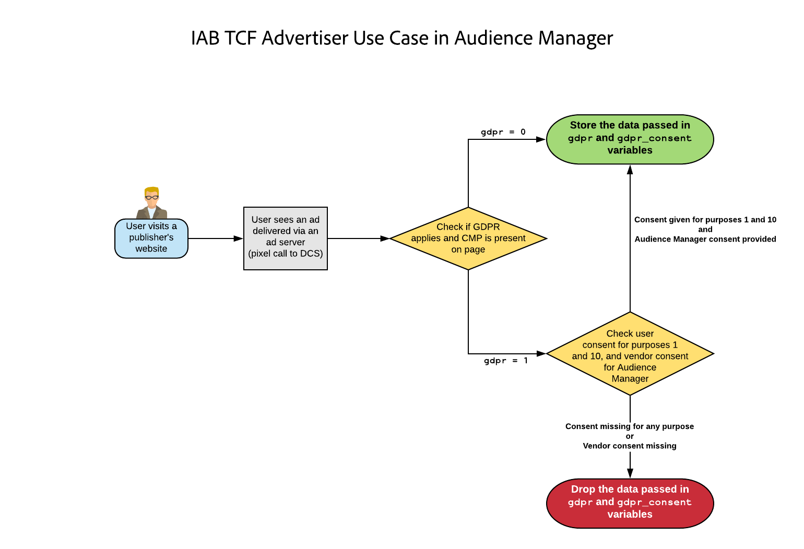

# Plug-in do Audience Manager para a Estrutura de consentimento do IAB {#aam-iab-plugin}

## Visão geral

Um aspecto importante nas obrigações de privacidade que você tem em relação aos seus usuários é a aquisição e o transporte de opções de usuário sobre como os dados pessoais deles podem ser usados (ou seja, “finalidade”) e por quem (ou seja, “empresas”).

A Adobe fornece o meio de gerenciar e comunicar as opções de privacidade de seus usuários por meio da [funcionalidade de Opt-in](https://docs.adobe.com/content/help/en/id-service/using/implementation/opt-in-service/optin-overview.html) e pelo suporte à [Estrutura de transparência e consentimento (TCF) do IAB](https://iabtechlab.com/standards/gdpr-transparency-and-consent-framework/).

Este artigo descreve os casos de uso do Audience Manager que oferecem suporte à TCF do IAB e como implementar tal suporte no Audience Manager. O Gerenciador de Audiências está registrado no TCF IAB com a ID do fornecedor 565.

O Plug-in do Audiência Manager para IAB TCF utiliza a funcionalidade [de](https://docs.adobe.com/content/help/en/id-service/using/implementation/opt-in-service/iab.html)aceitação, que, por sua vez, faz parte da biblioteca do Adobe [Adobe Experience Platform Identity Service (ECID)](https://docs.adobe.com/content/help/en/id-service/using/home.html) .

## Âmbito e limitações {#scope-and-limitations}

Como Editor ou Anunciante trabalhando com o Gerenciador de Audiências, você pode transmitir as opções do usuário ao Gerenciador de Audiências de acordo com o TCF da IAB. Isso fornece uma maneira fácil e consistente de comunicar as opções de usuário a todos os parceiros com os quais você trabalha e o Gerenciador de Audiências pode ajudá-lo a respeitar as opções de privacidade dos usuários.

O suporte do ICB TCF descrito neste artigo representa a primeira fase do suporte planejado pelo gestor de Audiências para o quadro IAB. Atualmente, o Gerenciador de Audiências não oferece suporte a:

* workflows para dispositivos móveis;
* Gestão do consentimento entre dispositivos;
* Acrescentar consentimento aos URLs enviados para destinos [](../../features/destinations/create-url-destination.md)URL;
* Anexar consentimento aos segmentos.

## Pré-requisitos {#prerequisites}

Você deve atender aos seguintes pré-requisitos para usar o TCF IAB com o Gerenciador de Audiências:

1. Você deve usar o Adobe Experience Platform Identity Service (ECID) versão 4.1 ou mais recente. [Baixe](https://github.com/Adobe-Marketing-Cloud/id-service/releases) nossa versão mais recente do ECID.
1. Você deve estar usando a Biblioteca de integração de dados (DIL) do Audiência Manager versão 9.0 ou mais recente, disponível para download [aqui](https://github.com/Adobe-Marketing-Cloud/dil/releases). Leia sobre o [DIL na documentação](../..//dil/dil-overview.md)do Gerenciador de Audiências.
1. Como alternativa, se você usar o encaminhamento pelo lado do servidor (SSF) para importar dados para o Audiência Manager, será necessário atualizar para a versão mais recente do AppMeasurement. Baixe o AppMeasurement usando o Gerenciador [de código do](https://docs.adobe.com/content/help/en/analytics/admin/admin-tools/code-manager-admin.html)Analytics.
1. Você deve estar usando uma Plataforma de Gerenciamento de Consentimento (CMP), comercial ou própria, compatível com o TCF da IAB, e está registrada no TCF da IAB. Consulte a lista de [CMPs registrados na estrutura](https://iabeurope.eu/cmp-list/)IAB.

## Recomendações e como implementar {#recommendations}

Para ativar o suporte ao TCF IAB no Gerenciador de Audiências, leia nossa documentação sobre [como configurar o IAB com a opção de participação](https://docs.adobe.com/content/help/en/id-service/using/implementation/opt-in-service/iab.html).

Isso é feito com mais facilidade usando o [Adobe Experience Platform Launch](https://docs.adobelaunch.com/) para instruir o ECID Opt-in em suas propriedades. Read the documentation for the [ECID Opt-in extension](https://docs.adobelaunch.com/extension-reference/web/experience-cloud-id-service-extension#opt-in) to learn how to set up the Launch extension.

## Fluxo de trabalho de escolha do usuário ao usar a estrutura IAB {#user-choice-workflow}

Ao visitar uma propriedade da Web, os usuários podem fornecer suas opções sobre como seus dados devem ser usados pelo editor e pelos fornecedores de terceiros com os quais o editor trabalha. Os usuários fornecem suas opções na forma de finalidades *e permissões* padrão para fornecedores ** terceiros registrados na lista global do fornecedor. A imagem abaixo representa um exemplo de uma caixa de diálogo CMP, exibida em um visitante pela primeira vez de um site. Lembre-se de que essa caixa de diálogo pode parecer muito diferente, com base na implementação do cliente.


Os objetivos padrão do quadro IAB são:

* armazenamento e acesso à informação
* Personalização
* Seleção de anúncios, delivery e relatórios
* Seleção de conteúdo, delivery e relatórios
* Medição

Consulte a página [de especificação da estrutura](https://github.com/InteractiveAdvertisingBureau/GDPR-Transparency-and-Consent-Framework/blob/master/Consent%20string%20and%20vendor%20list%20formats%20v1.1%20Final.md#purposes-features) IAB para obter uma descrição dos cinco objetivos padrão.

Os usuários podem conceder seu consentimento para uma combinação de finalidades padrão e fornecedores. Por exemplo, os usuários podem conceder seu consentimento para armazenamento, personalização e medição e conceder seu consentimento a todos os fornecedores de terceiros exibidos pelo CMP. Ou, em outro exemplo, eles poderiam conceder seu consentimento para os cinco fins padrão, mas apenas conceder o consentimento a alguns dos fornecedores exibidos pelo CMP.

Depois que o usuário seleciona suas opções de privacidade, as opções do usuário são registradas na sequência de caracteres de consentimento TCF do IAB. A cadeia de caracteres de consentimento TCF da IAB armazena a combinação de finalidades e fornecedores aprovados, juntamente com outras informações de metadados (consulte a página [da](https://github.com/InteractiveAdvertisingBureau/GDPR-Transparency-and-Consent-Framework/blob/master/Consent%20string%20and%20vendor%20list%20formats%20v1.1%20Final.md#Consent-string-and-vendor-list-format) IAB para obter mais informações). Todos os fornecedores registrados no IAB TCF avaliam a sequência de caracteres de consentimento do IAB TCF e tomam decisões com base nas opções de privacidade dos usuários. Lembre-se de que as opções de privacidade dos usuários são válidas para todos os fornecedores aprovados.

## Finalidades padrão necessárias ao Gerenciador de Audiências {#aam-standard-purposes}

O Gerenciador de Audiências avalia as opções dos usuários armazenadas na sequência de caracteres de consentimento TCF do IAB para:

* armazenamento de informações e acesso (ID de objetivo 1 na lista [do fornecedor](https://vendorlist.consensu.org/vendorlist.json)global)
* Personalização (ID de objetivo 2)
* Medição (ID de objetivo 5)
* O consentimento do fornecedor do Gerenciador de Audiências para armazenar, processar ou ativar dados para um editor.

>[!IMPORTANT]
>
>Audience Manager needs consent for *all three purposes, plus vendor consent* in order to deploy cookies and initiate or honor ID syncs.

## O comportamento do Gerenciador de Audiências depende se o usuário concede consentimento {#aam-behavior-consent}

O Gerenciador de Audiências funciona de forma diferente dependendo se o Gerenciador de Audiências detecta na sequência de caracteres de consentimento TCF do IAB que o usuário forneceu consentimento para os três fins (armazenamento, personalização, medição) ou não.

| Quando seu usuário *fornece consentimento*, o Gerenciador de Audiências: | Quando o usuário *recusar* o consentimento, o Gerenciador de Audiências: |
|---|---|
| <ul><li>Executa todos os casos de uso do Gerenciador de Audiências solicitados.</li><li>Transmite o consentimento a terceiros em sincronizações de ID (transmitindo gdpr = 1 e a sequência de caracteres de consentimento como gdpr_Consentimento em chamadas de sincronização de ID).</li><li>Avalia e respeita o consentimento passado dos pixels do servidor de publicidade.</li><li>Honra sincronizações de ID iniciadas pelo parceiro.</li></ul> | <ul><li>Não armazena dados novos do usuário na sua instância. Isso inclui IDs de parceiros, sinais, características ou dados de pixel.</li><li>Não inicia sincronizações de ID de terceiros.</li><li>Não aceita sincronizações de ID iniciadas pelo parceiro.</li></ul> |

## Caso de uso do editor {#publisher-use-case}

Ao implementar o TCF da IAB, você não é obrigado a manter o código personalizado para gerenciamento de consentimento nas suas propriedades da Web por meio de um mecanismo diferente com a Adobe ou outros fornecedores de terceiros. O caso de uso é descrito na imagem e nas etapas abaixo. Start à esquerda da imagem:

1. Um usuário visita uma de suas propriedades da Web. Desde que você esteja usando as versões mais recentes das bibliotecas ECID e DIL (consulte [Pré-requisitos](/help/using/overview/data-security-and-privacy/aam-iab-plugin.md#prerequisites)), o fluxo de aceitação é acionado.
2. O Gerenciador de Audiências verifica se o fluxo IAB se aplica (`isIabContext=true`). Consulte [Recomendações e como implementar](aam-iab-plugin.md#recommendations).
3. O Gerenciador de Audiências verifica se o RGPD se aplica (`gdpr = 1`) e se há um CMP, registrado com o IAB, na propriedade da Web. Por exemplo, tal aplicar-se-ia aos utilizadores que visitam o espaço da União europeia. Observe que é sua responsabilidade, como editor, definir o sinalizador do RGPD.
4. Se o RGPD for aplicado, o Gerenciador de Audiências verificará a string de consentimento do TCF IAB, transmitida no parâmetro `gdpr_consent`, para obter as permissões necessárias. O Gerenciador de Audiências precisa de permissões para o armazenamento, personalização, medição, além do consentimento do fornecedor do Audiência Manager, para armazenar, processar ou ativar dados.
5. Se a sequência de caracteres de consentimento TCF do IAB estiver presente e contiver as permissões necessárias, o Gerenciador de Audiências transmitirá a sequência de caracteres de consentimento TCF do IAB em nossos servidores [de coleta de](../../reference/system-components/components-data-collection.md) dados (DCS).
6. O Gerenciador de Audiências responde definindo um cookie [](https://docs.adobe.com/content/help/en/core-services/interface/ec-cookies/cookies-am.html) demdex no navegador. O Gerenciador de Audiências também inicia e honra sincronizações de IDs de terceiros.
7. Como alternativa, se a sequência de caracteres de consentimento TCF IAB transmitida na etapa 5 não contiver todas as permissões necessárias, o Gerenciador de Audiências não coletará, processará ou ativará dados e não honrará ou iniciará sincronizações de ID.


## Caso de uso do anunciante {#advertiser-use-case}

O Gerenciador de Audiências avalia e respeita o consentimento passado em chamadas [de](../../integration/sending-audience-data/real-time-data-integration/pixel-based-data-transfer.md)pixel, de acordo com o TCF da IAB.

Em geral, os pixels são colocados por clientes do Gerenciador de Audiências em suas páginas de parceiros ou são colocados em servidores de anúncios para inclusão na resposta do anúncio. No primeiro caso, seu parceiro deve recuperar programaticamente o parâmetro de consentimento e adicioná-lo ao pixel antes de disparar. No segundo caso, que é mais comum e é descrito detalhadamente abaixo, os servidores de anúncios anexam os parâmetros de consentimento que recebem da Plataforma do lado do suprimento (SSP) ou dos servidores de anúncios do editor a todos os pixels.

O Gerenciador de Audiências usa dois parâmetros para passar o consentimento do usuário em chamadas de pixel:

* `gdpr` pode ser 0 (RGPD não se aplica) ou 1 (RGPD se aplica);
* `gdpr_consent` é a sequência de caracteres de consentimento do RGPD com codificação base64 segura para URL (consulte a [especificação](https://github.com/InteractiveAdvertisingBureau/GDPR-Transparency-and-Consent-Framework/blob/master/URL-based%20Consent%20Passing_%20Framework%20Guidance.md#specifications)). Uma amostra de chamada para um pixel de impressão, com os dois parâmetros, pode ser a seguinte:

```
http://yourcompany.demdex.net/event?d_event=imp&gdpr=1&gdpr_consent=consentstring&d_src=datasource_id&d_site=siteID&d_creative=creative_id&d_adgroup=adgroup_id&d_placement=placement_id
```

O caso de uso é descrito na imagem e nas etapas abaixo. Start à esquerda da imagem:

1. Seu usuário recebe uma impressão por meio de um servidor de anúncios. Isso se traduz em uma chamada de pixel para nossos servidores de coleta de dados (DCS).
2. O Gerente de Audiências verifica se o indicador do RGPD se aplica. Caso contrário, o Gerenciador de Audiências armazena os dados transmitidos nas variáveis de macro em chamadas de pixel.
3. Se a sequência de caracteres de consentimento estiver presente e contiver as permissões necessárias, o Audiência Manager armazenará os dados transmitidos nas variáveis de macro em chamadas de pixel.
4. Se a sequência de caracteres de consentimento estiver ausente ou não tiver as permissões necessárias, o Gerenciador de Audiências soltará os dados transmitidos nas variáveis de macro em chamadas de pixel.



## Parceiros Ativações que oferecem suporte ao IAB TCF {#aam-activation-partners}

O Plug-in do Gerenciador de Audiências para IAB TCF permite encaminhar a sequência de caracteres de consentimento TCF do IAB para parceiros de ativação, respeitando ao mesmo tempo as opções de privacidade dos usuários. Para obter informações sobre quais parceiros de ativações suportam o TCF da IAB, consulte nossa [lista de destinos](/help/using/features/destinations/device-based-destinations-list.md)baseados em dispositivos.

## Testar sua implementação IAB {#test-iab-implementation}

Para testar se você implementou corretamente o Plug-in do Audiência Manager para IAB TCF, leia [Caso de uso 4 em Métodos de validação para aceitação e implementação](https://docs.adobe.com/content/help/en/id-service/using/implementation/opt-in-service/testing-optin-and-iab-plugin.html#section-64331998954d4892960dcecd744a6d88)IAB.

## IAB e opção de não participação no Gerenciador de Audiências. Ordem de precedência. {#iab-and-optout}

Outra opção de privacidade à disposição dos usuários é a capacidade de opt out toda a coleta de dados. A Adobe fornece aos usuários os meios para fazer isso na página [Suas escolhas](https://www.adobe.com/privacy/opt-out.html#customeruse) de privacidade.

O Gerenciador de Audiências aborda as solicitações de não participação em um artigo [separado em nossa documentação](data-privacy-requests.md).

>[!NOTE]
>
>**Ordem de precedência** - Se o usuário opt out da coleta de dados usando uma ferramenta de opção de não participação global, conforme descrito no link acima, isso terá precedência sobre as verificações de aceitação e IAB.

## Recursos adicionais {#additional-resources}

* [Aceitação do Adobe Experience Platform Identity Service](https://docs.adobe.com/content/help/en/id-service/using/implementation/opt-in-service/optin-overview.html)
* [Estrutura de Transparência e Consentimento do RGPD da Europa IAB](https://iabtechlab.com/standards/gdpr-transparency-and-consent-framework/)
* [Especificações técnicas do IAB Europe RGPD Transparência e Estrutura de Consentimento](https://github.com/InteractiveAdvertisingBureau/GDPR-Transparency-and-Consent-Framework/blob/master/Consent%20string%20and%20vendor%20list%20formats%20v1.1%20Final.md)
* [Plug-in IAB TCF - demonstração de vídeo](https://helpx.adobe.com/audience-manager/kt/using/iab-tcf-support-audience-manager-technical-video-implement.html)