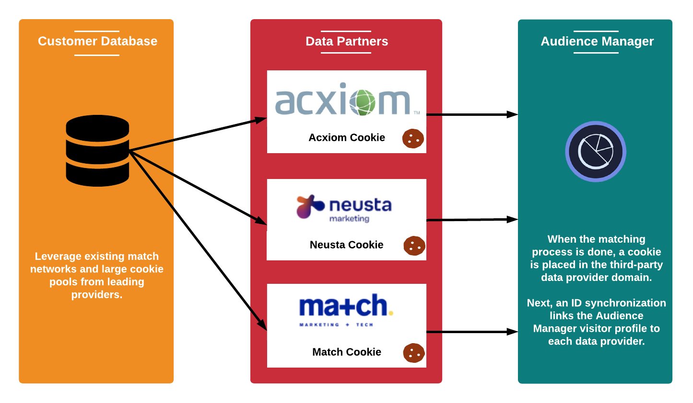

# Tipos de dados coletados {#types-of-data-collected}

[!DNL Audience Manager]O ajuda você a coletar e gerenciar dados primários, secundários e de terceiros.

Desbloquear os ativos de informações do cliente armazenados em vários silos é um dos maiores desafios relacionado a dados enfrentados pelas empresas atualmente. De [!DNL CRM] bancos de dados, sistemas de registro, servidores de anúncios e assim por diante, as empresas precisam de ferramentas que ajudem a centralizar dados valiosos e a gerenciar informações de clientes/públicos-alvo como um único ativo de dados estratégico. [!DNL Audience Manager]O ajuda você a desbloquear informações isoladas do cliente e gerenciar a coleta de dados de várias fontes. Os dados coletados podem ser gerenciados com base nos valores de tempo de vida ([!DNL TTL]) do elemento de dados, o que ajuda o editor a controlar a expiração dos dados em todas as fontes. [!DNL Audience Manager]O foi desenvolvido para ajudar você a gerenciar os seguintes tipos de dados:

| Tipo de dados | De onde os dados vêm |
|---|---|
| **Primários** | Clientes. Os dados são coletados online (de interações do consumidor em seus sites) ou offline. |
| **Secundários** | Parceiros estratégicos e anunciantes. |
| **Terceiros** | Fornecedores de dados e/ou intercâmbios. Os dados podem incluir informações como intenção, demografia, estilo de vida/social, psicografia e muito mais. |

## Coleta de dados primários {#first-party-data}

A coleta de dados primários é um recurso principal [!DNL Audience Manager] . Essa competência principal atende às necessidades de nossos clientes (editores ou anunciantes) que desejam usar dados proprietários como a base dos seus programas de marketing ou para direcionar e modelar em relação a outras fontes de dados.

[!DNL Audience Manager]O trabalha com os clientes para entender sua estratégia de dados e desenvolver um plano de coleta de dados personalizado. Nossa equipe de soluções de parceiros trabalha com você para avaliar sites, sinais de dados brutos e outras interações de usuários em seus sites. Com essas informações, ajudaremos você a criar uma estratégia de coleta de dados personalizada que capture sinais de dados no nível do usuário de várias páginas em seu inventário. Os dados capturados são armazenados e mapeados em uma taxonomia predefinida, que pode ser atualizada quando as necessidades da sua empresa mudarem.

O exemplo a seguir ilustra como possíveis elementos de dados podem ser capturados de uma página de compras de amostra.

| Item | Descrição |
|---|---|
| 1 | **Gênero**. O nome do comprador geralmente indica o sexo. Em nosso exemplo, o nome do comprador é Mary, então sabemos que o comprador é uma mulher. Os nomes nunca são armazenados pelo Audience Manager. |
| 2 | **Interesses**. Os itens no carrinho de compras podem indicar vários interesses. Em nosso exemplo, Maria gasta muito em equipamentos de ginástica. |
| 3 | **Tipo de endereço**. De acordo com os endereços de envio e/ou faturamento, você pode deduzir se Mary compra equipamentos de ginástica para ela mesma ou para uma empresa. |
| 4 | **Localização**. [!DNL ZIP] os códigos são mais confiáveis do que  [!DNL IP] os endereços para identificar um local. |
| 5 | **Afinidade de promoção**. Se um comprador usa códigos promocionais ou cartões-presente, provavelmente ele é um caçador de barganhas que procura as melhores ofertas. |
| 6 | **Poder de compra**. Os dados de preço correlacionados aos códigos [!DNL ZIP+4] indicam o poder de compra de um determinado local. |

Depois que os dados brutos são coletados, eles são mapeados de volta às características definidas pelo cliente na plataforma [!DNL Audience Manager]. A taxonomia e os mapeamentos de dados podem ser ajustados a qualquer momento sem alterar o código de coleta de dados.

## Coleta de dados secundários {#second-party-data}

Os dados de terceiros vêm de um parceiro comercial estratégico (não são dados do editor). Essas informações são coletadas e gerenciadas da mesma forma que os dados primários.

Em um cenário de dados de terceiros, os anunciantes enviam seus próprios ativos de dados para os editores para que eles possam combinar essas informações com os dados do editor e, em seguida, executar um programa de publicidade mais direcionado. Além disso, os editores podem estender seu público-alvo através de parcerias com anunciantes. Na maioria dos casos, esses acordos envolvem relações contratuais limitadas à colocação da tag do container [!DNL Audience Manager] no site do parceiro para facilitar a coleta e o compartilhamento de dados.

Um exemplo de coleta e recomercialização de dados de terceiros poderia envolver um varejista de roupas coletando dados sobre seus produtos e depois compartilhando essas informações com os principais parceiros. Nesse caso, o varejista pode oferecer diferentes anúncios em um site parceiro [!DNL Audience Manager] para consumidores que escolheram várias cores e tamanhos de jaqueta.

## Coleta de dados de terceiros {#third-party-data}

Dados de terceiros são informações coletadas e compartilhadas por fornecedores fora do [!DNL Audience Manager].

Os dados de terceiros podem ser usados para qualificar os dados existentes [!UICONTROL segments] (por exemplo, idade, renda familiar e assim por diante), fornecer dados que estão sob demanda mas não estão disponíveis de outra forma ou ser usados em modelagem semelhante a uma base de usuário conhecida a partir de dados primários e de terceiros. [!DNL Audience Manager]O trabalha com vários provedores de dados de terceiros e ajudará você a entender o tipo de dados que esses provedores coletam para que você possa fazer as negociações estratégicas certas com cada provedor.

>[!NOTE]
>
>Para obter uma lista completa de provedores de dados de terceiros compatíveis com o [!DNL Audience Manager], consulte o [Localizador de público-alvos da Adobe](https://www.adobe-audience-finder.com/).

[!DNL Audience Manager] O integra-se com outros provedores de dados com base em seus conjuntos de dados  [!DNL APIs] e disponíveis. A coleta de dados funciona em tempo real, à medida que um usuário navega em seu site, ou por metodologias fora de banda nas quais as IDs são sincronizadas entre parceiros e os dados são transferidos entre servidores depois que um usuário deixa seu site. Em ambos os casos, [!DNL Audience Manager] os clientes obtêm a vantagem de ter dados de terceiros sincronizados em nossa plataforma, o que significa que cada cliente, ou domínio, não precisa executar sua própria sincronização. Dessa forma, você aumenta o alcance e reduz as chamadas do servidor da página.

## Parceiros de correspondência {#match-partners}

Muitos clientes escolhem trabalhar com parceiros de correspondência de dados de terceiros. Essas entidades têm relacionamentos com sites que têm requisitos de registro e podem processar arquivos de dados do cliente, combinando-os (em tempo real) com base em sua rede de registro.

