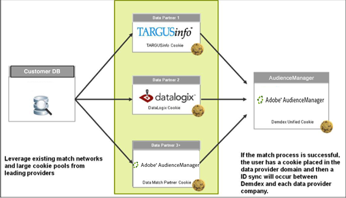

# Tipos de dados coletados{#types-of-data-collected}

O Audience Manager ajuda você a coletar e gerenciar dados primários, de terceiros e de terceiros.

Desbloquear os ativos de informações do cliente armazenados em vários silos é um dos maiores desafios de dados enfrentados pelas empresas atualmente. Desde bancos de dados CRM, sistemas de registro, servidores de anúncios, e assim por diante, as empresas exigem ferramentas que ajudem a centralizar dados valiosos e a gerenciar as informações do cliente/público como um único ativo de dados estratégico. O Audience Manager ajuda você a desbloquear informações isoladas do cliente e gerenciar a coleta de dados de várias fontes. Os dados coletados podem ser gerenciados com base nos valores de TTL (time-to-live) do elemento de dados, o que ajuda o editor a controlar a expiração dos dados em todas as fontes. O Audience Manager é projetado para ajudar a gerenciar os seguintes tipos de dados:

| Tipo de dados | De onde os dados vêm |
|---|---|
| **Primeiro partido** | Clientes. Os dados são coletados online (de interações do consumidor em seus sites) ou offline. |
| **Segundo partido** | Parceiros estratégicos e anunciantes. |
| **Terceiros** | Fornecedores de dados e/ou intercâmbios. Os dados podem incluir informações como intenção, demografia, estilo de vida/social, psicográfico e muito mais. |

## First-Party Data Collection {#first-party-data}

A coleta de dados primários é um recurso principal do Audience Manager. Essa competência principal atende às necessidades de nossos clientes (editores ou anunciantes) que desejam usar dados proprietários como a pedra angular de seus programas de marketing ou para segmentar e modelar em relação a outras fontes de dados.

<!-- 

c_1st_party_data.xml

 -->

O Audience Manager trabalha com clientes para entender sua estratégia de dados e mapeia essa estratégia de volta para um plano de coleta de dados personalizado. Nossa equipe de soluções de parceiros trabalha com você para avaliar sites, sinais de dados brutos e outras interações de usuários em seus sites. Com essas informações, ajudaremos você a criar uma estratégia de coleta de dados personalizada que capture sinais de dados no nível do usuário de várias páginas em seu inventário. Os dados capturados são armazenados e mapeados de volta para uma taxonomia predefinida, que pode ser atualizada a qualquer momento, conforme as necessidades de sua empresa mudam.

O exemplo a seguir ilustra como elementos de dados potenciais podem ser capturados de uma página de compras de amostra.

| Item | Descrição |
|---|---|
| 1 | **Gênero**. O nome do comprador geralmente indica o sexo. Em nosso exemplo, o nome do comprador é Mary, então sabemos que o comprador é uma mulher. Os nomes nunca são armazenados pelo Audience Manager. |
| 2 | **Interesses**. Os itens no carrinho de compras podem indicar vários interesses. Em nosso exemplo, Maria gasta muito em equipamentos de fitness. |
| 3 | **Tipo** de alojamento. Com base nos endereços de envio e/ou faturamento, você pode deduzir se a Mary compra equipamentos de adequação para si mesma ou para uma empresa. |
| 4 | **Localização**. Os códigos ZIP são mais confiáveis do que endereços IP quando se trata de identificar um local. |
| 5 | **Afinidade** de promoção. Se um comprador usa códigos promocionais ou cartões-presente, provavelmente ele é um caçador de barganhas procurando os melhores acordos. |
| 6 | **Gastando energia**. Os dados de preço correlacionados aos códigos ZIP+4 indicam o poder de gastos de determinado local. |

Depois que os dados brutos são coletados, eles são mapeados de volta às características definidas pelo cliente na plataforma do Audience Manager. A taxonomia e os mapeamentos de dados podem ser ajustados a qualquer momento sem fazer alterações no código de coleta de dados.

## Coleta de dados de terceiros {#second-party-data}

Os dados de terceiros vêm de um parceiro comercial estratégico (não são dados do editor). Essas informações são coletadas e gerenciadas da mesma forma que os dados primários.

<!-- 

c_2nd_party_data.xml

 -->

Em um cenário de dados de terceiros, os anunciantes enviam seus próprios ativos de dados para os editores para que eles possam combinar essas informações com os dados do editor e, em seguida, executar um programa de publicidade mais direcionado. Além disso, os editores podem ampliar seu público-alvo através de parcerias com seus anunciantes. Na maioria dos casos, esses acordos envolvem relações contratuais limitadas à colocação da tag de contêiner do Audience Manager no site do parceiro para facilitar a coleta e o compartilhamento de dados.

Um exemplo de coleta e recomercialização de dados de terceiros poderia envolver um varejo de roupas que colecionasse dados sobre seus produtos e depois compartilhasse essas informações com os principais parceiros. Nesse caso, o varejista poderia oferecer diferentes anúncios em um site de parceiros do Audience Manager para consumidores que escolhiam várias cores e tamanhos da jaqueta.

## Third-Party Data Collection {#third-party-data}

Dados de terceiros são informações coletadas e compartilhadas por fornecedores fora do Audience Manager.

<!-- 

c_3rd_party_data.xml

 -->

Os dados de terceiros podem ser usados para qualificar segmentos de dados existentes (por exemplo, idade, renda familiar e assim por diante), fornecer dados que estão sob demanda mas não estão disponíveis de outra forma, ou ser usados em modelagem semelhante a uma base de usuários conhecida a partir de dados primários e de terceiros. O Audience Manager trabalha com vários provedores de dados de terceiros e o ajudará a entender o tipo de dados que esses provedores coletam para que você possa fazer as negociações estratégicas certas com cada provedor.

>[!NOTE]
>
>Para obter uma lista completa dos provedores de dados de terceiros suportados pelo [!DNL Audience Manager], consulte o [Adobe Audience Finder](https://www.adobe-audience-finder.com/).

O Audience Manager é integrado com outros provedores de dados com base em suas APIs e conjuntos de dados disponíveis. A coleta de dados funciona em tempo real, à medida que um usuário navega em seu site, ou por metodologias fora de banda nas quais as IDs são sincronizadas entre parceiros e os dados são transferidos entre servidores depois que um usuário deixa seu site. Em ambos os casos, os clientes do Audience Manager têm a vantagem de ter dados de terceiros sincronizados em nossa plataforma, o que significa que cada cliente, ou domínio, não precisa executar sua própria sincronização. Isso ajuda a aumentar o alcance e reduz as chamadas do servidor da página.

## Parceiros de correspondência {#match-partners}

Muitos clientes escolhem trabalhar com parceiros de correspondência de dados de terceiros. Essas entidades têm relacionamentos com sites que têm requisitos de registro e podem processar arquivos de dados do cliente, combinando-os (em tempo real) com base em sua rede de registro.

