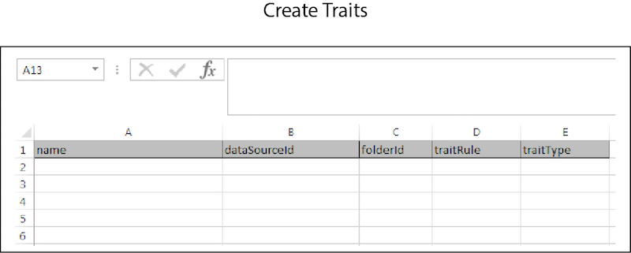

# Criação em massa{#bulk-create}

A criação em massa permite que você construa várias fontes de dados, sinais derivados, segmentos, características e outros itens com uma única operação. Siga estas instruções para fazer uma solicitação de criação em massa.

<!-- 

t_bulk_create.xml

 -->

>[!NOTE]
>
>[As permissões](../../features/administration/administration-overview.md) de grupo RBAC atribuídas na [!DNL Audience Manager] interface do usuário são respeitadas na [!UICONTROL Bulk Management Tools].

>[!CAUTION]
>
>Não misture tipos de objetos em uma solicitação de criação em massa. Os cabeçalhos de cada objeto são exclusivos e não podem ser combinados. Limpe a planilha e faça uma solicitação separada para itens diferentes.

Para criar objetos em massa, abra a [!UICONTROL Bulk Management Tools] planilha e:

1. Clique na **[!UICONTROL Headers]** guia e copie os cabeçalhos de criação para o item que você deseja adicionar.
2. Click the **[!UICONTROL Create]** tab.
3. Cole os cabeçalhos de criação na primeira linha da planilha de atualização.
4. Cole ou digite os dados que deseja alterar em uma coluna correspondente com base no rótulo do cabeçalho.
5. Na barra de ferramentas da planilha, clique no botão criar que corresponde ao item que você está atualizando.
Essa ação abre a caixa de [!UICONTROL Account Information] diálogo.
6. Forneça as informações [necessárias para o](../../reference/bulk-management-tools/bulk-management-intro.md#auth-reqs) logon e clique em **[!UICONTROL Submit]**.

A planilha cria uma [!UICONTROL Results] coluna. A [!UICONTROL Results] coluna retorna a resposta JSON para uma operação bem-sucedida. Consulte as APIs  REST para obter exemplos. Antes de inserir dados, a planilha de criação em massa deve ser semelhante ao exemplo a seguir. Observe que todas as diferentes opções de criação não são mostradas aqui. Isso é incluído para ajudá-lo a entender como uma planilha concluída pode ser.

Se sua atualização em massa retornar um erro ou falhar, consulte [Solução de problemas para ferramentas](../../reference/bulk-management-tools/bulk-troubleshooting.md)de gerenciamento em massa.
