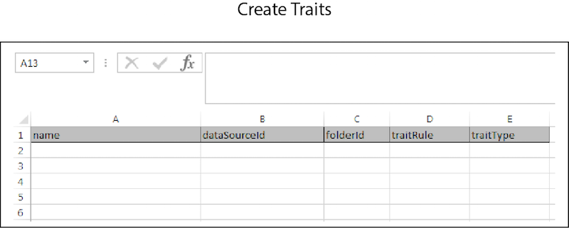

# Criar em massa{#bulk-create}

A criação em massa permite construir várias fontes de dados, sinais derivados, segmentos, características e outros itens com uma única operação. Siga estas instruções para fazer uma solicitação de criação em massa.

>[!IMPORTANT]
>
>As Ferramentas de gerenciamento em massa não são uma oferta oficialmente compatível com o Adobe. A solução de problemas e o suporte por meio do Atendimento ao cliente serão tratados caso a caso.

<!-- 

t_bulk_create.xml

 -->

>[!NOTE]
>
>As [permissões do grupo RBAC](../../features/administration/administration-overview.md) atribuídas na interface do usuário [!DNL Audience Manager] são honradas no [!UICONTROL Bulk Management Tools].

>[!CAUTION]
>
>Não misture tipos de objeto em uma solicitação de criação em massa. Os cabeçalhos de cada objeto são exclusivos e não podem ser combinados. Limpe a planilha e faça uma solicitação separada para itens diferentes.

Para criar objetos em massa, abra a planilha [!UICONTROL Bulk Management Tools] e:

1. Clique na guia **[!UICONTROL Headers]** e copie os cabeçalhos de criação do item que deseja adicionar.
2. Clique na guia **[!UICONTROL Create]**.
3. Cole os cabeçalhos de criação na primeira linha da planilha de atualização.
4. Cole ou digite os dados que deseja alterar em uma coluna correspondente com base no rótulo do cabeçalho.
5. Na barra de ferramentas da planilha, clique no botão Criar que corresponda ao item que você está atualizando.
Esta ação abre a caixa de diálogo [!UICONTROL Account Information].
6. Forneça as [informações de logon](../../reference/bulk-management-tools/bulk-management-intro.md#auth-reqs) necessárias e clique em **[!UICONTROL Submit]**.

A planilha cria uma coluna [!UICONTROL Results]. A coluna [!UICONTROL Results] retorna a resposta JSON para uma operação bem-sucedida. Consulte as [REST APIs](../../api/rest-api-main/rest-api-main.md) para obter exemplos. Antes de inserir dados, sua planilha de criação em massa deve ser semelhante ao exemplo a seguir. Observe que todas as diferentes opções de criação não são mostradas aqui. Isso é incluído para ajudá-lo a entender como uma planilha concluída pode ser.

Se a atualização em massa retornar um erro ou falhar, consulte [Solução de problemas das Ferramentas de Gerenciamento em Massa](../../reference/bulk-management-tools/bulk-troubleshooting.md).
