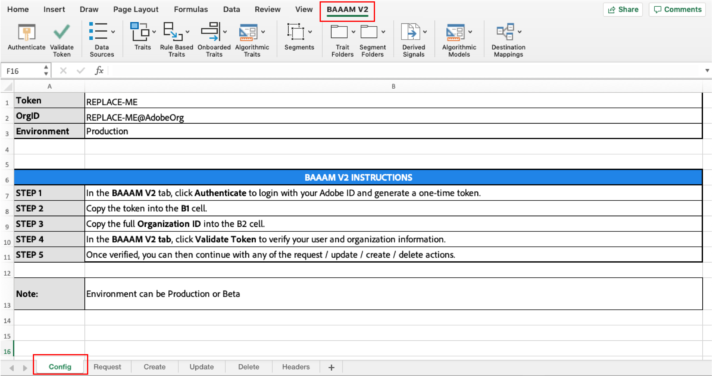

# Introdução ao gerenciamento em massa{#getting-started-with-bulk-management}

O [!DNL Bulk Management Tools] permite criar e gerenciar vários objetos de uma só vez com uma única operação. Você pode usar o [!DNL Bulk Management Tools] para trabalhar com o [!UICONTROL data sources], [!UICONTROL derived signals], [!UICONTROL destinations], [!UICONTROL folders], [!UICONTROL models], [!UICONTROL segments] e [!UICONTROL traits].

>[!IMPORTANT]
>
>As Ferramentas de gerenciamento em massa não são uma oferta de Adobe oficialmente compatível. A solução de problemas e o suporte por meio do Atendimento ao cliente serão tratados caso a caso.

<!-- 

c_bulk_start.xml

 -->

>[!NOTE]
>
>As [permissões do grupo RBAC](../../features/administration/administration-overview.md) atribuídas na interface do usuário [!DNL Audience Manager] são respeitadas no [!UICONTROL Bulk Management Tools].

## Visão geral {#overview}

Este recurso usa uma planilha do [!DNL Microsoft Excel] com macros que fazem chamadas seguras e autenticadas para as APIs do [!DNL Audience Manager]. A API fornece os métodos e serviços que permitem fazer alterações em massa. Você não precisa saber como codificar ou trabalhar com nossas APIs para usá-lo. A planilha contém cabeçalhos e guias de coluna que executam funções específicas de alteração em massa. Para fazer alterações em massa, basta adicionar os cabeçalhos predefinidos às planilhas específicas, fornecer as informações que deseja alterar em massa e clicar em um botão de ação. A planilha e as APIs fazem o resto do trabalho para você.

## Baixar {#download}

Baixe a planilha mais recente **[aqui](assets/BAAAM_V2_20210609.xlsm)** (última atualização em junho de 2021).

## Pré-requisitos {#prereqs}

Para usar o [!DNL Bulk Management Tools], você precisa do seguinte:

* Seu login do [!DNL Experience Cloud]. Como cliente do, você já deve ter essas credenciais.
* A planilha [!DNL Bulk Management Tools]. [Baixe a planilha](assets/BAAAM_V2_20210609.xlsm) para obter a versão mais recente.
* [!DNL Microsoft Excel] em execução em [!DNL macOS] ou [!DNL Microsoft Windows] de 64 bits. Recomendamos que você use a versão mais recente do [!DNL Microsoft Excel].
* Ao abrir a planilha, você deve **Habilitar Macros** para que o [!DNL Bulk Management Tools] funcione.

## Requisitos e opções de autenticação {#auth-reqs}

As alterações em massa exigem autenticação. Antes de realizar qualquer ação, é necessário fazer logon. Como a planilha faz chamadas de API, é necessário configurá-la para autenticar em sua conta de usuário.

**Requisitos de autenticação de API**

A segunda versão do [!DNL Bulk Management Tools], lançada em outubro de 2019, simplifica o processo de autenticação. As etapas de autenticação dessa versão são descritas abaixo:

1. Abra a planilha e navegue até a planilha **[!UICONTROL Config]**.
2. Siga as etapas descritas na planilha.
   
3. Após concluir as etapas, você está autorizado a fazer alterações em massa.

Ao fazer alterações em massa, ainda será necessário confirmar que você está autorizado a fazer as alterações, mas a autenticação da API é automática.

**Opções de autenticação de domínio**

A autenticação de domínio oferece a opção de testar solicitações em massa ou aplicá-las diretamente à conta de produção. Fazer alterações em massa no ambiente beta não afetará sua conta de produção. As alterações na produção entram em vigor imediatamente. A planilha de gerenciamento em massa permite que você trabalhe nos seguintes ambientes:

* Beta
* Produção

## Ações e operações {#actions-ops}

A planilha [!UICONTROL Bulk Management Tools] consiste em botões de autenticação, guias de ação, botões de ação e uma guia **[!UICONTROL Headers]**. A guia **[!UICONTROL Headers]** contém os cabeçalhos de coluna pré-formatados usados pelas guias de ação. As guias de ação contêm macros que executam a operação em massa selecionada. Para executar uma operação em massa, copie um conjunto de cabeçalhos na guia de ação apropriada, insira os dados do cabeçalho e clique em um botão de ação.

Após [autenticar](#auth-reqs), clique em um botão de ação para começar.

A tabela abaixo lista as operações que você pode executar e os itens que você pode manipular com as planilhas [!UICONTROL Bulk Management Tools].

<table id="table_B9B3E09B692E42BAA52FB32C18B00709"> 
 <thead> 
  <tr> 
   <th colname="col1" class="entry"> Ações </th> 
   <th colname="col2" class="entry"> Objetos </th> 
  </tr> 
 </thead>
 <tbody> 
  <tr> 
   <td colname="col1"> 
As ações em massa são exibidas em guias na parte inferior da planilha e incluem: 
 
 
     <ul id="ul_49F46B9E00C045D29E40258EB7BDCFBB"> 
      <li id="li_193C41EA19EF4D738FBA037D2BF9B05C">Solicitações </li> 
      <li id="li_5BE2E13D839F4958AAA5C01B7EFC5096">Atualização </li> 
      <li id="li_4CCCC739795945DF8C89787F9A67EB88">Criar  </li> 
      <li id="li_C7D36D2BDF0448CEAF3A5EABE41038E8">Estimar </li> 
      <li id="li_07A3E94326124A3092362D9896EB7732">Excluir </li> 
     </ul> 
 </td> 
   <td colname="col2"> 
Os objetos que você pode alterar em massa estão localizados na guia <b> Cabeçalhos</b> e incluem: 
 
 
     <ul id="ul_A7A96F2B1B63430B9A1E1184AC5FA8F2"> 
      <li id="li_E3D9E2E190B04BE685337AC6140C371C"> <a href="../../features/datasources-list-and-settings.md#data-sources-list-and-settings"> Fontes de dados</a> </li> 
      <li id="li_B645385E40684FA28770913EAF18CB2C"> <a href="../../features/derived-signals.md"> Sinais derivados</a> </li> 
      <li id="li_9059F8C4A41A410899BDEFC76D3F5949"> <a href="../../features/destinations/destinations.md"> Destinos</a> </li> 
      <li> <a href="../../features/algorithmic-models/understanding-models.md"> Modelos</a> </li> 
      <li id="li_BB5A445150754E53AA38C78461326932"> <a href="../../features/traits/trait-storage.md#trait-storage"> Pastas de características</a> e pastas de segmentos </li> 
      <li id="li_7A27DBF64E0945CF8AE8C96E8C6EDA09"> <a href="../../features/segments/segments-purpose.md"> Segmentos</a> </li> 
      <li id="li_A4640A34930040DEA8555EAF0AE2A702"> <a href="../../features/traits/trait-details-page.md"> Características</a> </li> 
     </ul> 
 </td> 
  </tr> 
 </tbody> 
</table>

**Exemplo de operação em massa**

Como exemplo, vamos dar uma olhada em como criar várias características de uma vez. Para criar várias características em uma operação em massa, você deve:

1. Clique na guia **[!UICONTROL Headers]** e copie todos os rótulos na opção [!UICONTROL Create a Trait].
2. Clique na guia **[!UICONTROL Create]** e cole os rótulos começando na linha 1, coluna A.
3. Forneça informações relacionadas a cada cabeçalho de coluna e clique em **[!UICONTROL Create Traits]**. Essa ação solicita que você confirme sua autenticação. Seu trabalho em massa é executado depois que você confirma sua autenticação. Verifique o canto inferior esquerdo da planilha para obter uma notificação de status do trabalho.

>[!NOTE]
>
>Ao trabalhar com solicitações grandes, a planilha pode ficar sem resposta e parecer inativa. Nesses casos, deixe-o em paz. A planilha se tornará responsiva quando a solicitação em massa for concluída. Se a planilha não responder por um longo período, consulte a [seção solução de problemas](../../reference/bulk-management-tools/bulk-troubleshooting.md).
