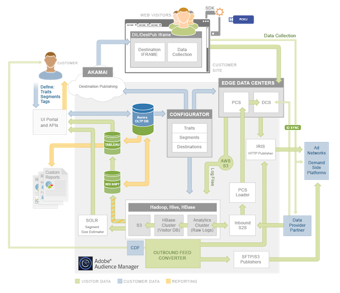

# Arquitetura da plataforma: mapa de fluxo de dados{#platform-architecture-data-flow-map}

Este mapa contém os principais sistemas de Audience Manager. Ele representa visualmente como os dados fluem para dentro, fora e entre componentes Audience Manager.

## Como ler este mapa {#compmap}

<!-- 

c_compmap.xml

 -->

No mapa, a caixa cinza contém [!DNL Audience Manager] sistemas. Alguns componentes são completamente internos e outros ficam no limite entre [!DNL Audience Manager] e no mundo exterior. Como um [!DNL Audience Manager] cliente, os componentes internos geralmente são transparentes ou inacessíveis. No entanto, às vezes você pode se envolver com esses sistemas por meio da interface do usuário ou de integrações de dados. Os sistemas na borda da caixa coletam e enviam dados entre [!DNL Audience Manager] e no mundo exterior.

As cores definem o tipo de dados que fluem para dentro e para fora [!DNL Audience Manager]. Verde são os dados do cliente, azul são os dados do cliente (pessoas que visitam o site) e laranja são os dados usados para os relatórios.

Para obter descrições e resumos do sistema, consulte os dados [ação](../../reference/system-components/components-data-action.md), [coleção](../../reference/system-components/components-data-collection.md), [processando](../../reference/system-components/components-data-processing.md), e [gerenciamento de tags](../../reference/system-components/components-tag-management.md) seções.

