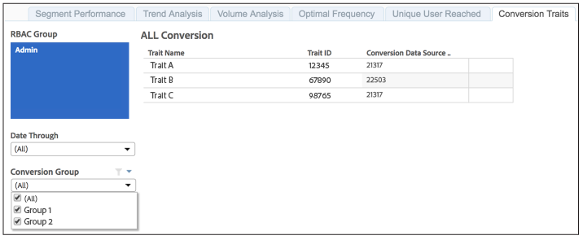

# Características de conversão relatadas{#reported-conversion-traits}

O relatório Características de conversão mostra todas as características rotuladas como características de conversão para um grupo de conversão em uma determinada data.

As características de conversão para grupos de conversão podem mudar de execução de relatório para execução de relatório. O relatório exibe as características de conversão por grupo de conversão para a data de relatório selecionada.

Para saber como criar características de conversão no Audience Manager, assista ao vídeo abaixo:

>[!VIDEO](https://video.tv.adobe.com/v/23431/)

## Exemplo de relatório

O relatório [!UICONTROL Reported Conversion Traits] pode ser semelhante ao mostrado abaixo:

