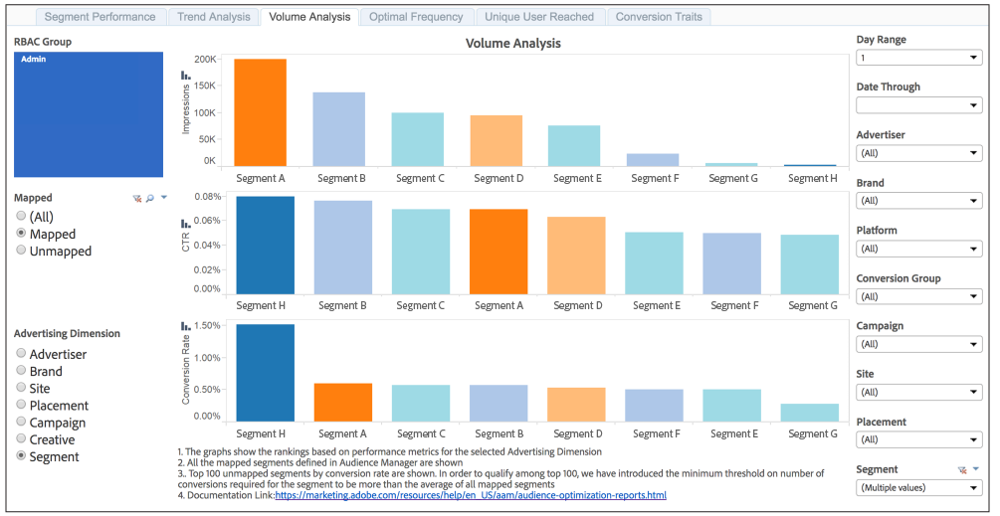

# [!UICONTROL Trend Analysis] e [!UICONTROL Volume Analysis] Relatórios{#trend-analysis-and-volume-analysis-reports}

Esses relatórios retornam dados sobre impressões, taxas de click-through e conversões para uma ampla variedade de dimensões de publicidade. Compare as tendências e o volume das métricas selecionadas para obter uma imagem melhor do desempenho da campanha ao longo do tempo.

## Amostra [!UICONTROL Trend Analysis] Relatório {#sample-trend-analysis}

A variável [!UICONTROL Trend Analysis] O relatório retorna dados em um gráfico de linhas somente para um intervalo de 14 dias. Neste exemplo, o relatório mostra tendências de impressão, click-through e conversão para um conjunto de segmentos mapeados.

## Amostra [!UICONTROL Volume Analysis] Relatório {#sample-volume-analysis}

A variável [!UICONTROL Volume Analysis] O relatório retorna dados em um gráfico de barras para o intervalo de datas selecionado. Neste exemplo, o relatório mostra impressões, click-throughs e conversões por volume para um conjunto de segmentos mapeados.

>[!NOTE]
>
>Os períodos retroativos de 7 dias e 30 dias só estão disponíveis para domingo **[!UICONTROL Date Through]** datas.

>[!TIP]
>
>Para obter informações sobre segmentos mapeados e não mapeados, consulte [Relatório de desempenho do segmento](../../../reporting/audience-optimization-reports/aor-advertisers/segment-performance.md) documentação.
