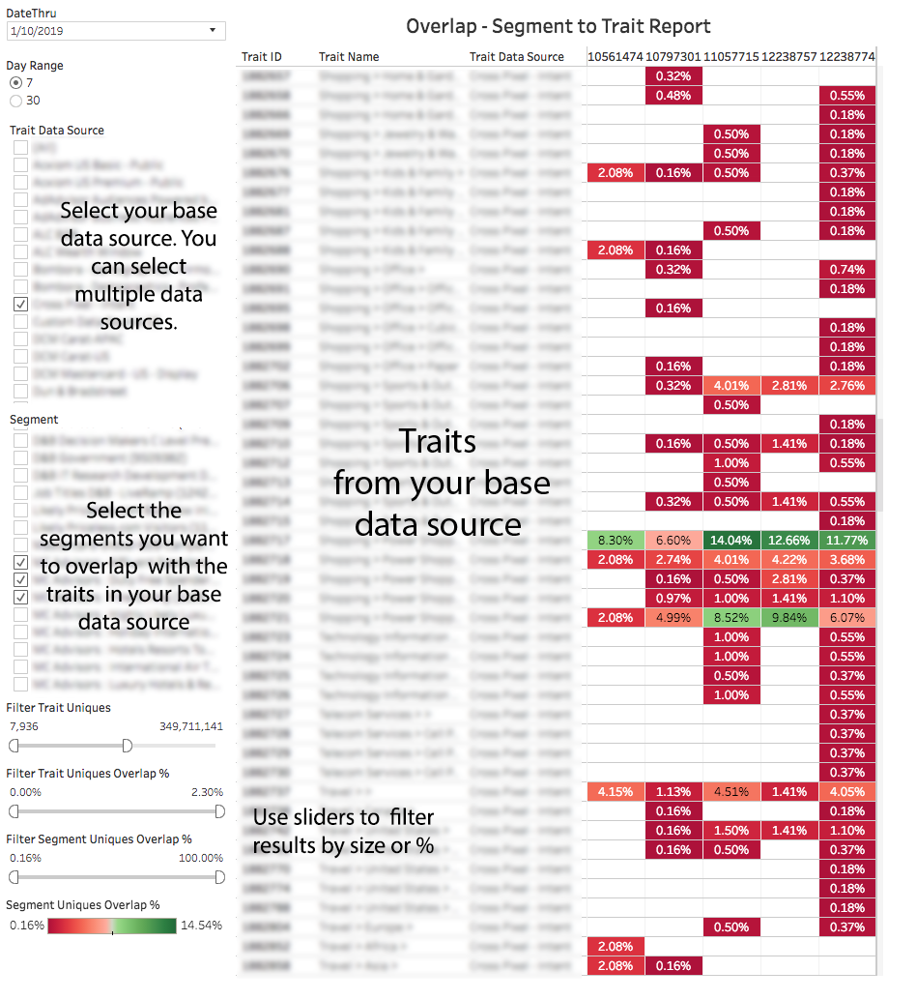

# Relatório de sobreposição de segmento por característica{#segment-to-trait-overlap-report}

Retorna dados sobre o número de usuários únicos compartilhados entre uma característica específica e um segmento inteiro.

>[!NOTE]
>
>Os relatórios de Sobreposição no Audience Manager seguem os princípios do RBAC. Você só pode ver segmentos e características de fontes de dados às quais você tem acesso com base no [Grupo de Usuários RBAC](/help/using/features/administration/administration-overview.md) ao qual você pertence.

<!-- 

c_segment_trait_overlap.xml

 -->

## Visão geral

Como ferramenta de otimização, os relatórios do [!UICONTROL Segment to Trait Overlap] ajudam a criar segmentos altamente focalizados ou expandir o alcance dos segmentos. Por exemplo, você pode criar segmentos e características focalizados com alta sobreposição para alcançar um público específico. No entanto, muitas sobreposições podem significar menos usuários únicos (menos alcance). Executar este relatório para ajudar a expandir o alcance, removendo características com muita sobreposição de segmento e substituindo-as por características com menos sobreposição.

### Exemplo de relatório

A ilustração a seguir fornece uma visão geral de alto nível do relatório [!UICONTROL Segment-to-Trait Overlap].

### Analisar Pontos de Dados Individuais

Selecione um ponto individual para ver os detalhes dos dados em uma janela pop-up. Suas ações de clique atualizam automaticamente os dados exibidos no relatório.

## Comparação de segmentos com características {#comparing-segments-to-traits}

Descreve como você pode comparar segmentos e características para obter informações significativas dos resultados.

<!-- 

c_compare_s2t.xml

 -->

### Comparação de características e segmentos únicos: um exemplo

À primeira vista, pode parecer ilógico comparar segmentos a características e tentar tirar conclusões dos resultados. Afinal, segmentos e características são diferentes, então como os dados derivados de itens diferentes podem ter significado? No entanto, nesse caso, não estamos comparando características e segmentos, mas o número de visitantes únicos compartilhados entre eles. A contagem de visitantes únicos compartilhados fornece o valor comum que torna possível a comparação entre um segmento e uma característica.

O diagrama a seguir ilustra a relação entre uma característica e o segmento ao qual ela pertence. Nesse caso, temos uma característica com 10 visitantes e um segmento com 1.000 visitantes. Eles compartilham três visitantes únicos em comum.

A contagem de visitantes únicos é o valor constante e comum compartilhado entre essas diferentes classes de objetos. Como resultado, você pode determinar a relação de visitante único entre eles da seguinte maneira:

* A característica compartilha 30% de seus visitantes únicos com o segmento (3/10 = 0,30).
* O segmento compartilha 0,3% de seus visitantes únicos com a característica (3/1.000 = 0,003)

### Encontrar valor em comparações de segmento para característica

Observar a sobreposição entre características e segmentos pode ajudar a estimar o pool total de visitantes disponível (previsão) ou encontrar segmentos ineficientes com muita sobreposição.

<table id="table_5B211EF95216426299EB20253A5A9C1B"> 
 <thead> 
  <tr> 
   <th colname="col1" class="entry"> Caso de uso </th> 
   <th colname="col2" class="entry"> Descrição </th> 
  </tr>
 </thead>
 <tbody> 
  <tr> 
   <td colname="col1"><b>Previsão</b> </td> 
   <td colname="col2"> 
Para determinar o pool de visitantes disponível, some a diferença entre o total da característica (menos sobreposição) e o total do segmento (menos sobreposição). 
 
Essa combinação de segmento e característica pode chegar a até 1.004 novos usuários. 
 </td> 
  </tr> 
  <tr> 
   <td colname="col1"><b>Encontrar Segmentos Ineficientes</b> </td> 
   <td colname="col2"> 
Se uma característica fizer parte de um grupo  AND em uma definição de segmento, os visitantes únicos que têm essa característica já estarão no segmento e não estarão disponíveis para adição ao segmento. Você pode usar esse relatório para encontrar características relevantes com baixa sobreposição e adicioná-las à definição do segmento, aumentando assim o alcance desse pool de público-alvo do segmento. 
 </td> 
  </tr> 
 </tbody> 
</table>

## Como entender os filtros de dados no relatório de sobreposição de segmento por característica {#data-filters-s2t-report}

Descreve como os controles deslizantes de % de sobreposição exclusiva de característica e segmento funcionam.

<!-- 

r_s2t_sliders.xml

 -->

O relatório [!UICONTROL Segment-to-Trait overlap] permite usar dois controles deslizantes para filtrar dados pela % de sobreposição por característica ou segmento.

* **[!UICONTROL Filter Trait Uniques %:]** Filtra os dados pela % de visitantes únicos compartilhados entre a característica e o segmento.
* **[!UICONTROL Filter Segment Uniques Overlap %:]** Filtra os dados pela % de compartilhamento de visitantes únicos entre o segmento e a característica.

### Exemplo

O diagrama a seguir ilustra a diferença entre a % de características únicas e a % de características únicas do segmento. Nesse caso, a característica e o segmento compartilham 3 visitantes únicos. Em proporções:

* A característica compartilha 30% de seus visitantes únicos com o segmento (3/10 = 0,30).
* O segmento compartilha 0,3% de seus visitantes únicos com a característica (3/1.000 = 0,003)

## Campos Pop de dados de segmento por característica definidos {#fields-defined}

Descreve as métricas exibidas na janela pop-up quando você clica em um ponto de dados individual.

<!-- 

r_s2t_data_pop.xml

 -->

O pop-up para o relatório [!UICONTROL Segment-to-Trait Overlap] contém as métricas abaixo. Observe que a métrica única na tabela representa seus *usuários em tempo real*.

<table id="table_4AF72754276242FFB11543635B43AD90"> 
 <thead> 
  <tr> 
   <th colname="col1" class="entry"> Métrica </th> 
   <th colname="col2" class="entry"> Descrição </th> 
  </tr>
 </thead>
 <tbody> 
  <tr> 
   <td colname="col1"><b> ID do segmento</b> </td> 
   <td colname="col2"> ID numérica exclusiva do segmento. </td> 
  </tr> 
  <tr> 
   <td colname="col1"><b> Source de dados de características </b> </td> 
   <td colname="col2"> Nome do proprietário da característica. </td> 
  </tr> 
  <tr> 
   <td colname="col1"><b> Tipo de Source de Dados</b> </td> 
   <td colname="col2">Define o tipo de provedor ao qual uma característica pertence. Pode ser: 
    <ul id="ul_0477C04A33FD4F5D998B98984E6554D3"> 
     <li id="li_50FCA48EDB5843AB8FB6C34ED2C0067D">Primário (sua própria característica). </li> 
     <li id="li_4F6148EDAEFE43FA8D505944E9FE3855">Terceiros (de um parceiro/fornecedor de dados externo). </li> 
    </ul> </td> 
  </tr> 
  <tr> 
   <td colname="col1"><b> ID da característica</b> </td> 
   <td colname="col2"> ID numérica exclusiva da característica. </td> 
  </tr> 
  <tr> 
   <td colname="col1"><b> Nome da característica</b> </td> 
   <td colname="col2"> Nome da característica. </td> 
  </tr> 
  <tr> 
   <td colname="col1"><b> Sobreposição de Características Exclusivas %</b> </td> 
   <td colname="col2"> % de visitantes únicos que uma característica compartilha com o segmento. </td> 
  </tr> 
  <tr> 
   <td colname="col1"><b> Sobreposição de Únicas de Segmento %</b> </td> 
   <td colname="col2"> % de visitantes únicos que um segmento compartilha com uma característica. </td> 
  </tr> 
  <tr> 
   <td colname="col1"><b> Únicos de sobreposição</b> </td> 
   <td colname="col2"> Número de visitantes únicos compartilhados entre o segmento e a característica. </td> 
  </tr> 
  <tr> 
   <td colname="col1"><b> Segmentos únicos</b> </td> 
   <td colname="col2"> Número de visitantes únicos no segmento. </td> 
  </tr> 
  <tr> 
   <td colname="col1"><b> Características únicas</b> </td> 
   <td colname="col2"> Número de visitantes únicos na característica. </td> 
  </tr> 
 </tbody> 
</table>

>[!MORELIKETHIS]
>
>* [Filtrar resultados do relatório com os controles deslizantes de dados](../../reporting/dynamic-reports/data-sliders.md)
>* [Formas, Cores e Tamanhos Usados em Relatórios Interativos](../../reporting/dynamic-reports/interactive-report-technology.md#shapes-colors-sizes)
>* [Explicação dos Ícones e Ferramentas do Relatório](../../reporting/dynamic-reports/interactive-report-technology.md#icons-tools-explained)
>* [Relatórios de sobreposição: Atualizar agendamento e tamanho mínimo do segmento](../../reporting/dynamic-reports/overlap-minimum-segment-size.md)
>* [Amostragem de Dados e Taxas de Erro em Relatórios de Audience Manager Selecionados...](../../reporting/report-sampling.md)
>* [Arquivos CSV para relatórios de sobreposição](../../reporting/dynamic-reports/overlap-csv-files.md)
