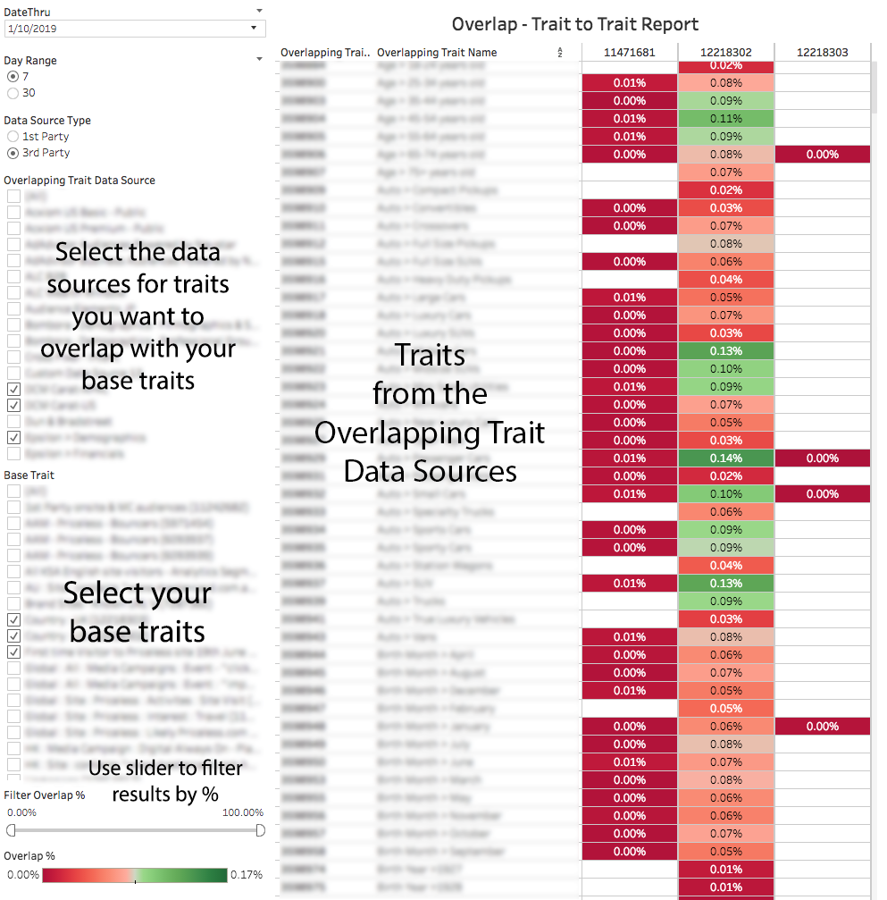

# Relatório de sobreposição de característica por característica{#trait-to-trait-overlap-report}

Retorna dados sobre o número de usuários únicos compartilhados entre todas as suas características originais e de terceiros.

>[!NOTE]
>
>Os relatórios de Sobreposição no Audience Manager seguem os princípios do RBAC. Você só pode ver características de fontes de dados às quais você tem acesso com base no [Grupo de usuários RBAC](/help/using/features/administration/administration-overview.md) a que você pertence.

<!-- 

c_overlap_reports.xml

 -->

## Visão geral

A variável [!UICONTROL Trait-to-Trait Overlap] O relatório retorna dados sobre a % de usuários únicos compartilhados entre todas as suas próprias características e suas características de terceiros. Como uma ferramenta de otimização, esse relatório ajuda a:

* Crie segmentos com sobreposição alta ou baixa, dependendo das suas necessidades. As características com alta sobreposição fornecem um público-alvo direcionado, mas com menos visitantes únicos. Características com baixa sobreposição podem ser úteis para atingir um conjunto maior e exclusivo de visitantes.
* Validar dados de características de terceiros: a forte sobreposição entre características originais e de terceiros semelhantes sugere que a característica do seu parceiro de dados é precisa e confiável. Por outro lado, uma baixa sobreposição pode indicar que uma característica de terceiros pode não conter as mesmas informações que sua própria característica própria semelhante.
* Encontre sobreposições inesperadas entre características e use essas informações para criar segmentos inovadores.

## Exemplo de relatório

A ilustração a seguir fornece uma visão geral de alto nível dos elementos da [!UICONTROL Trait-to-Trait Overlap] relatório.

>[!NOTE]
>
>A variável [!UICONTROL Trait-to-Trait Overlap] O relatório retorna um campo vazio quando compara a mesma característica a si mesmo.

>[!NOTE]
>
>As Características de pasta não estão disponíveis para comparação nos relatórios de sobreposição de característica por característica. Ao criar um segmento utilizando uma característica de pasta específica, é possível executar a análise por meio da [relatório de sobreposição de segmento por característica](/help/using/reporting/dynamic-reports/segment-trait-overlap-report.md).

## Analisar Pontos de Dados Individuais

Selecione um ponto individual para ver os detalhes dos dados em uma janela pop-up. Suas ações de clique atualizam automaticamente os dados exibidos no relatório.

## Campos Pop De Dados De Sobreposição De Característica Por Característica Definidos {#field-definitions}

Descreve as métricas exibidas na janela pop-up quando você clica em um ponto de dados individual.

<!-- 

r_t2t_data_pop.xml

 -->

O pop-up para o [!UICONTROL Trait-to-Trait Overlap] contém as métricas abaixo. Observe que a métrica única na tabela representa seus *usuários em tempo real*.

<table id="table_A2A0CFC47C1A404994B82E6630E711A2"> 
 <thead> 
  <tr> 
   <th colname="col1" class="entry"> Métrica </th> 
   <th colname="col2" class="entry"> Descrição </th> 
  </tr>
 </thead>
 <tbody> 
  <tr> 
   <td colname="col1"><b> % de sobreposição</b> </td> 
   <td colname="col2"> Mostra a % de sobreposição exclusiva entre as características comparadas (únicos de sobreposição/únicos de característica). </td> 
  </tr> 
  <tr> 
   <td colname="col1"><b> Tipo de fonte de dados</b> </td> 
   <td colname="col2">Define o tipo de fonte de dados à qual uma característica pertence. Pode ser: 
    <ul id="ul_0477C04A33FD4F5D998B98984E6554D3"> 
     <li id="li_50FCA48EDB5843AB8FB6C34ED2C0067D">Primário (sua própria característica). </li> 
     <li id="li_4F6148EDAEFE43FA8D505944E9FE3855">Terceiros (de um parceiro/fornecedor de dados externo). </li> 
    </ul> </td> 
  </tr> 
  <tr> 
   <td colname="col1"><b> ID de característica sobreposta</b> </td> 
   <td colname="col2"> ID numérica exclusiva para a característica sobreposta. </td> 
  </tr> 
  <tr> 
   <td colname="col1"><b> Sobreposição do nome da característica</b> </td> 
   <td colname="col2"> Nome da característica sobreposta. </td> 
  </tr>
    <tr> 
   <td colname="col1"><b> ID da característica 2</b> </td> 
   <td colname="col2"> ID numérica exclusiva para a característica na sua fonte de dados base. </td> 
  </tr> 
  <tr> 
   <td colname="col1"><b> Nome da característica 2</b> </td> 
   <td colname="col2"> Nome da característica na sua fonte de dados base. </td> 
  </tr> 
  <tr> 
   <td colname="col1"><b> Sobrepor únicos</b> </td> 
   <td colname="col2"> 
Para obter a % de sobreposição, o Audience Manager usa a seguinte fórmula:
 
Únicos sobrepostos / (Únicos de característica base + Únicos de característica sobrepostos - Únicos sobrepostos)
 </td> 
  </tr> 
  <tr> 
   <td colname="col1"><b> Sobreposição de características únicas</b> </td> 
   <td colname="col2"> O número de visitantes únicos da característica sobreposta. </td> 
  </tr> 
    <tr> 
   <td colname="col1"><b> Características básicas únicas</b> </td> 
   <td colname="col2"> O número de visitantes únicos da característica base. </td> 
  </tr> 
 </tbody> 
</table>

>[!MORELIKETHIS]
>
>* [Filtrar resultados do relatório com os controles deslizantes de dados](../../reporting/dynamic-reports/data-sliders.md)
>* [Formas, Cores e Tamanhos Usados em Relatórios Dinâmicos](../../reporting/dynamic-reports/interactive-report-technology.md#shapes-colors-sizes)
>* [Explicação dos ícones e ferramentas de relatório](../../reporting/dynamic-reports/interactive-report-technology.md#icons-tools-explained)
>* [Relatórios de sobreposição: Atualizar agendamento e tamanho mínimo do segmento](../../reporting/dynamic-reports/overlap-minimum-segment-size.md)
>* [Amostragem de dados e taxas de erro em alguns relatórios do Audience Manager...](../../reporting/report-sampling.md)
>* [Arquivos CSV para relatórios de sobreposição](../../reporting/dynamic-reports/overlap-csv-files.md)

