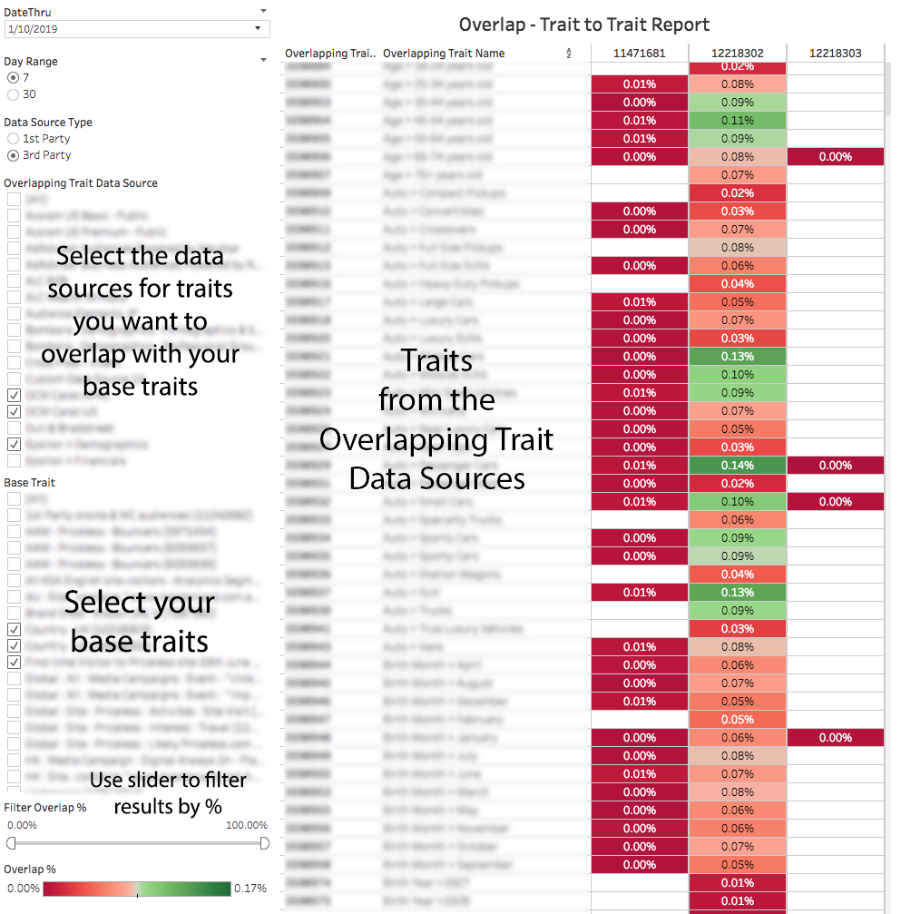

# Relatório de sobreposição de característica por característica{#trait-to-trait-overlap-report}

Retorna dados sobre o número de usuários únicos compartilhados entre todas as suas características originais e de terceiros.

>[!NOTE]
>
>Os relatórios de sobreposição no Audience Manager seguem os princípios do RBAC. Você só pode ver características de fontes de dados às quais você tem acesso com base no [Grupo de Usuários RBAC](/help/using/features/administration/administration-overview.md) ao qual você pertence.

<!-- 

c_overlap_reports.xml

 -->

## Visão geral

O relatório [!UICONTROL Trait-to-Trait Overlap] retorna dados sobre a % de usuários únicos compartilhados entre todas as suas características e suas características de terceiros. Como uma ferramenta de otimização, esse relatório ajuda a:

* Crie segmentos com sobreposição alta ou baixa, dependendo das suas necessidades. As características com alta sobreposição fornecem um público-alvo direcionado, mas com menos visitantes únicos. Características com baixa sobreposição podem ser úteis para atingir um conjunto maior e exclusivo de visitantes.
* Validar dados de características de terceiros: a forte sobreposição entre características originais e de terceiros semelhantes sugere que a característica do seu parceiro de dados é precisa e confiável. Por outro lado, uma baixa sobreposição pode indicar que uma característica de terceiros pode não conter as mesmas informações que sua própria característica própria semelhante.
* Encontre sobreposições inesperadas entre características e use essas informações para criar segmentos inovadores.

## Exemplo de relatório

A ilustração a seguir fornece uma visão geral de alto nível dos elementos no relatório [!UICONTROL Trait-to-Trait Overlap].

>[!NOTE]
>
>O relatório [!UICONTROL Trait-to-Trait Overlap] retorna um campo vazio quando compara a mesma característica a si mesmo.

>[!NOTE]
>
>As Características de pasta não estão disponíveis para comparação nos relatórios de sobreposição de característica por característica. Ao criar um segmento utilizando uma característica de pasta específica, você pode realizar análise através do [relatório de sobreposição de segmento por característica](/help/using/reporting/dynamic-reports/segment-trait-overlap-report.md).

## Analisar Pontos de Dados Individuais

Selecione um ponto individual para ver os detalhes dos dados em uma janela pop-up. Suas ações de clique atualizam automaticamente os dados exibidos no relatório.

## Campos Pop De Dados De Sobreposição De Característica Por Característica Definidos {#field-definitions}

Descreve as métricas exibidas na janela pop-up quando você clica em um ponto de dados individual.

<!-- 

r_t2t_data_pop.xml

 -->

O pop-up para o relatório [!UICONTROL Trait-to-Trait Overlap] contém as métricas abaixo. Observe que a métrica única na tabela representa seus *usuários em tempo real*.

<table id="table_A2A0CFC47C1A404994B82E6630E711A2"> 
 <thead> 
  <tr> 
   <th colname="col1" class="entry"> Métrica </th> 
   <th colname="col2" class="entry"> Descrição </th> 
  </tr>
 </thead>
 <tbody> 
  <tr> 
   <td colname="col1"><b> Sobreposição %</b> </td> 
   <td colname="col2"> Mostra a % de sobreposição exclusiva entre as características comparadas (únicos de sobreposição/únicos de característica). </td> 
  </tr> 
  <tr> 
   <td colname="col1"><b> Tipo de Source de Dados</b> </td> 
   <td colname="col2">Define o tipo de fonte de dados à qual uma característica pertence. Pode ser: 
    <ul id="ul_0477C04A33FD4F5D998B98984E6554D3"> 
     <li id="li_50FCA48EDB5843AB8FB6C34ED2C0067D">Primário (sua própria característica). </li> 
     <li id="li_4F6148EDAEFE43FA8D505944E9FE3855">Terceiros (de um parceiro/fornecedor de dados externo). </li> 
    </ul> </td> 
  </tr> 
  <tr> 
   <td colname="col1"><b> ID de Característica Sobreposta</b> </td> 
   <td colname="col2"> ID numérica exclusiva para a característica sobreposta. </td> 
  </tr> 
  <tr> 
   <td colname="col1"><b> Sobreposição do Nome da Característica</b> </td> 
   <td colname="col2"> Nome da característica sobreposta. </td> 
  </tr>
    <tr> 
   <td colname="col1"><b> ID da Característica 2</b> </td> 
   <td colname="col2"> ID numérica exclusiva para a característica na sua fonte de dados base. </td> 
  </tr> 
  <tr> 
   <td colname="col1"><b> Nome da Característica 2</b> </td> 
   <td colname="col2"> Nome da característica na sua fonte de dados base. </td> 
  </tr> 
  <tr> 
   <td colname="col1"><b> Únicos de sobreposição</b> </td> 
   <td colname="col2"> 
Para obter a % de sobreposição, o Audience Manager usa a seguinte fórmula:
 
Únicos sobrepostos / (Únicos de característica base + Únicos de característica sobrepostos - Únicos sobrepostos)
 </td> 
  </tr> 
  <tr> 
   <td colname="col1"><b> Características únicas sobrepostas</b> </td> 
   <td colname="col2"> O número de visitantes únicos da característica sobreposta. </td> 
  </tr> 
    <tr> 
   <td colname="col1"><b> Características básicas</b> </td> 
   <td colname="col2"> O número de visitantes únicos da característica base. </td> 
  </tr> 
 </tbody> 
</table>

>[!MORELIKETHIS]
>
>* [Filtrar resultados do relatório com os controles deslizantes de dados](../../reporting/dynamic-reports/data-sliders.md)
>* [Formas, Cores e Tamanhos Usados em Relatórios Dinâmicos](../../reporting/dynamic-reports/interactive-report-technology.md#shapes-colors-sizes)
>* [Explicação dos Ícones e Ferramentas do Relatório](../../reporting/dynamic-reports/interactive-report-technology.md#icons-tools-explained)
>* [Relatórios de sobreposição: Atualizar agendamento e tamanho mínimo do segmento](../../reporting/dynamic-reports/overlap-minimum-segment-size.md)
>* [Amostragem de Dados e Taxas de Erro em Relatórios Selecionados do Audience Manager...](../../reporting/report-sampling.md)
>* [Arquivos CSV para relatórios de sobreposição](../../reporting/dynamic-reports/overlap-csv-files.md)
