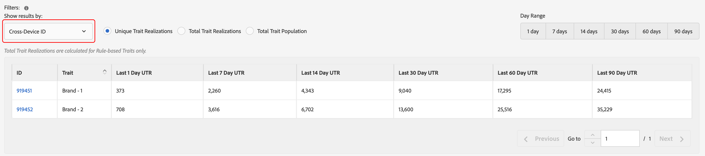
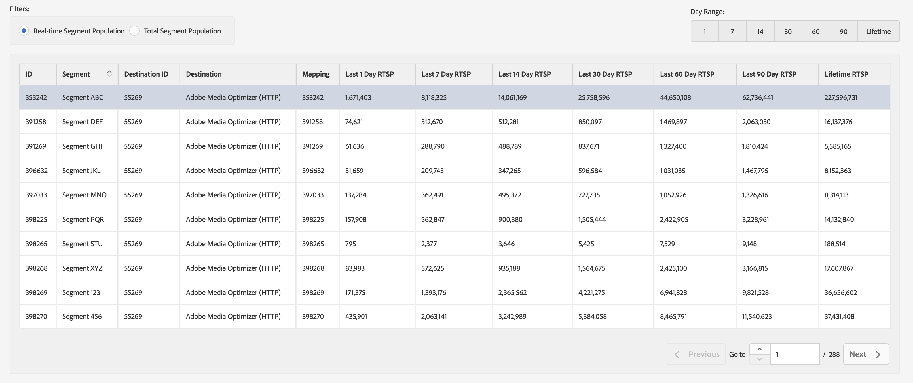

# Relatórios gerais{#general-reports}

Um relatório [!UICONTROL General] retorna dados de desempenho em características, segmentos e destinos.

## Visão geral {#general-reports-overview}

<!-- 

c_general_reports.xml

 -->

[!DNL Audience Manager] O usa  [!UICONTROL Role Based Access Control] ([!UICONTROL RBAC]) para estender as permissões do grupo de usuários aos  [!UICONTROL General] relatórios. Os usuários podem ver somente as características e os segmentos nos relatórios que têm permissões para visualizar. [!UICONTROL RBAC] permite controlar quais dados de relatórios as equipes internas podem visualizar. Por exemplo, uma agência que gerencia diferentes contas de anunciantes pode configurar permissões de grupo de usuários para que uma equipe que gerencia a conta do anunciante A não possa ver os dados de relatório do anunciante B.

Execute um relatório [!UICONTROL General] quando precisar:

* Analise o desempenho por característica, segmento ou destino.
* Rastreie impressões (total e exclusivas) em intervalos de 1, 7, 14, 30, 60 e 90 dias.
* Revise as contagens de carga total e exclusiva.
* Compare o desempenho de características e segmentos.
* Identifique características e segmentos de desempenho robustos ou ruins, analise a demanda ou compare dados de carga/fogo com relatórios de terceiros.
* Exportar dados (formato .csv) para análise e compartilhamento adicionais.

A ilustração a seguir fornece uma visão geral de alto nível de elementos-chave no relatório [!UICONTROL General].

1. Configure as seguintes opções:

   * **Tipo de relatório:** selecione o tipo de relatório desejado (Característica, Segmento ou Destino).

   * **Para datas até:** especifique o intervalo de datas do relatório.

2. Procure por uma característica, segmento ou destino por nome ou ID.
3. Na lista de pastas, arraste e solte as características, segmentos ou destinos que deseja relatar para o painel [!UICONTROL Selections] no lado direito.
4. Gere o relatório a ser exibido em uma tabela exportável.

## Executar um Relatório Geral {#run-general-report}

Esta seção descreve como executar um relatório [!UICONTROL General] e definir o tempo e outras opções de desempenho.

<!-- 

t_run_general_report.xml

 -->

1. No painel **[!UICONTROL Analytics]**, clique em **[!UICONTROL General Reports]**.
1. Na lista suspensa **[!UICONTROL Report Type]**, selecione o tipo desejado: Característica, segmento ou destino.
1. ** CondicionalClique na caixa de data para exibir um calendário, em seguida, selecione a data final do seu relatório se desejar especificar uma data diferente de hoje.
1. Procure por uma característica, segmento ou destino por nome ou ID.
1. Na lista de pastas, arraste e solte as características, segmentos ou destinos que deseja relatar para o painel [!UICONTROL Selections] no lado direito.
1. Clique em **[!UICONTROL Run Report]**.

   Os resultados são exibidos em uma tabela exportável. Clique nos cabeçalhos da coluna para classificar os resultados em ordem crescente ou decrescente.
1. Selecione o botão de opção desejado na parte superior do relatório para filtrar dados por desempenho ( [!UICONTROL Unique Trait Realizations], [!UICONTROL Total Trait Realizations] ou [!UICONTROL Total Trait Population]) ou por tempo (1, 7, 14, 30, 60 ou intervalo de 90 dias).

   >[!NOTE]
   >
   >[!UICONTROL Total Trait Realizations] são calculadas  [!UICONTROL Rule-based Traits] somente para .

1. ** OpcionalClique em  **[!UICONTROL Export to CSV]**. Isso exporta [!UICONTROL Unique Trait Realizations], [!UICONTROL Total Trait Realizations] e [!UICONTROL Total Trait Population] para todos os intervalos de dia.

## Explicação dos resultados dos relatórios gerais {#general-reports-explained}

Os números em [!UICONTROL General Reports] são gerados diretamente de nosso [!UICONTROL User Profile Store]. Os resultados refletem o número de usuários [!DNL Audience Manager] contidos no backend no momento em que esses números de relatório foram gerados.

* Esses números não incluem IDs de visitante com tráfego excessivo. O tráfego de bots é filtrado antes de chegar ao nosso sistema de back-end. Além disso, algum tráfego de bot é descartado durante um trabalho de limpeza semanal executado no back-end.
* Se você integrar dados por meio do processamento de entrada digitado do [!DNL Audience Manager] UUID, e essas IDs incluírem usuários que não estão mais ativos em nosso sistema, esses [!DNL Audience Manager] UUIDs inativos nunca chegarão ao [!UICONTROL User Profile Store] e não serão relatados.
* [!UICONTROL Total Trait Realizations] são calculadas  [!UICONTROL Rule-based Traits] somente para .

## Resultados gerais de relatórios para características {#general-report-results-traits}

Os filtros abaixo estão disponíveis ao executar um relatório Geral e selecionar **[!UICONTROL Trait]** como o tipo de relatório.

Ao filtrar os resultados por [!UICONTROL Device ID]:

* [!UICONTROL Unique Trait Realizations] é o número de visitantes anônimos do dispositivo que adicionaram a característica ao perfil dentro do intervalo de tempo selecionado.
* [!UICONTROL Total Trait Realization] é o número total de realizações de características anônimas no intervalo de tempo selecionado.
* [!UICONTROL Total Trait Population] é o número de visitantes anônimos do seu dispositivo que têm essa característica no perfil.

Ao filtrar os resultados por [!UICONTROL Cross-Device ID]:

* [!UICONTROL Unique Trait Realizations] é o número de seus visitantes autenticados que adicionaram a característica ao perfil, dentro do intervalo de tempo selecionado.
* [!UICONTROL Total Trait Realization] é o número total de realizações de características autenticadas no intervalo de tempo selecionado.
* [!UICONTROL Total Trait Population] é o número de seus visitantes autenticados que têm essa característica em seu perfil.

<!-- 
### Unique Trait Realizations

This metric represents the unique number of [Audience Manager Unique User IDs (UUID)](../reference/ids-in-aam.md) that qualified for the trait in your selected time range. For example, if a user visited your homepage three times on 10/1, you would see one Unique Trait Realization.

### Total Trait Realizations

This metric represents the total amount of trait fires for the trait in your selected time range. For example, if a user visited your homepage, then navigated to your tech news and your sports news sections, they would appear in the General Report as three total trait realizations, and one unique trait realization.

### Total Trait Population

This metric represents the total amount of Audience Manager UUIDs that are currently qualified for the trait. Use this number to understand the total amount of users you could use for segmentation and targeting. Typically, users remain part of a trait for [120 days](../features/traits/create-onboarded-rule-based-traits.md#set-expiration-interval). For example, a user visiting your homepage three times today and never returning afterwards, would remain as a user in this population every day until 120 days from now. At the 120 day mark, they would be removed from the population. Read our [Trait and Segment Qualification Reference](../features/traits/trait-and-segment-qualification-reference.md) for more examples on the difference between Unique Trait Realizations and Total Trait Population.

The illustration below shows the results of running a general report for the Trait report type. -->
<!-- 
 -->

## Resultados gerais dos relatórios para segmentos {#general-report-results-segments}

As métricas abaixo estão disponíveis ao executar um relatório Geral e selecionar **[!UICONTROL Segment]** como o tipo de relatório:

### População de segmentos em tempo real

Essa métrica representa o número real de visitantes únicos vistos em tempo real para o intervalo de tempo especificado e que foram qualificados para o segmento no momento em que foram vistos pelo Audience Manager.

### População total do segmento

Essa métrica representa o número total de UUIDs de Audience Manager qualificados para o segmento no período de análise selecionado. Seu preenchimento total de segmentos de 1 dia representa a base de usuário mais precisa para o direcionamento.

>[!NOTE]
>
>Selecione **[!UICONTROL Include Destination Mappings]** para ver um detalhamento da população do segmento para destinos ativados.

A ilustração abaixo mostra os resultados da execução de um relatório geral para o tipo de relatório Segmento .

## Resultados gerais dos relatórios para destinos {#general-report-results-destinations}

As métricas abaixo estão disponíveis ao executar um relatório Geral e selecionar **[!UICONTROL Destination]** como o tipo de relatório:

**População de segmentos em tempo real**

Essa métrica representa o número real de visitantes únicos vistos em tempo real para o intervalo de tempo especificado e que foram qualificados para o segmento no momento em que foram vistos pelo Audience Manager.

**População total do segmento**

Essa métrica representa o número total de UUIDs de Audience Manager pertencentes a um segmento no período de análise, que foram enviadas para um destino.

A ilustração abaixo mostra os resultados da execução de um relatório geral para o tipo de relatório Destinos .

