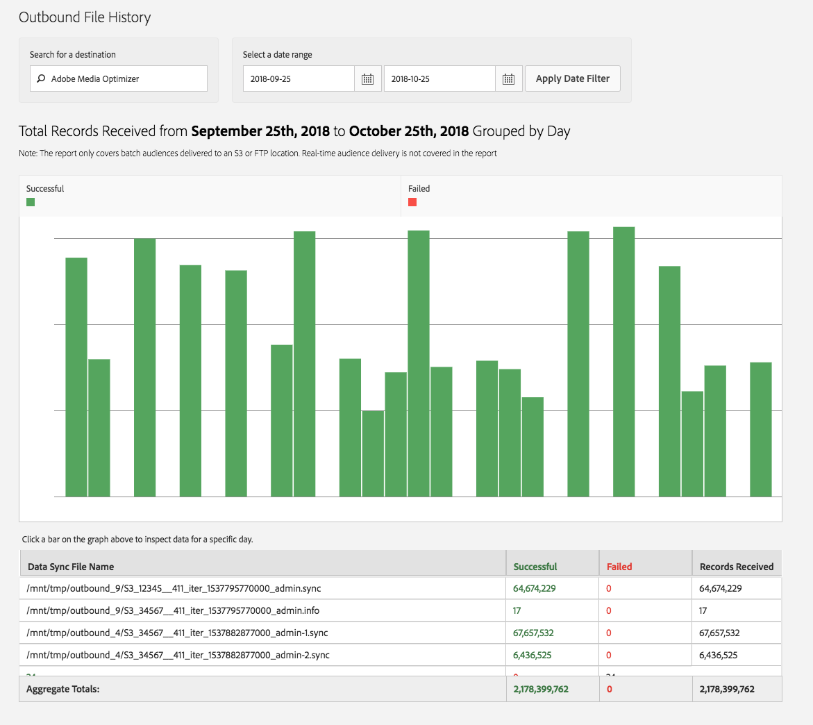

# Histórico de arquivos de saída {#outbound-file-history}

Exibir informações históricas de trabalho em lotes de saída para um destino e um período de tempo especificados.

<!-- 

t_reports_outbound_history.xml

 -->

1. Clique em **[!UICONTROL Analytics]** > **[!UICONTROL Outbound File History]**.

   

1. Na caixa **[!UICONTROL Search for a Destination]**, comece a digitar e selecione o destino desejado.
1. Na caixa **[!UICONTROL Select a Date Range]**, especifique as datas de início e término do relatório e clique em **[!UICONTROL Apply Date Filter]**.

   

   A tabela a seguir contém informações correspondentes às colunas no relatório:

<table id="table_93076D46AC50411395E72B9B987E99BE"> 
 <thead> 
  <tr> 
   <th colname="col1" class="entry"> Linha </th> 
   <th colname="col2" class="entry"> Descrição </th> 
  </tr> 
 </thead>
 <tbody> 
  <tr> 
   <td colname="col1"> Nome do Arquivo de Sincronização de Dados </td> 
   <td colname="col2"> 
Lista de todos os arquivos de saída que o  Adobe gerou para este destino que foram processados juntos. 
 </td> 
  </tr> 
  <tr> 
   <td colname="col1"> Bem-sucedido </td> 
   <td colname="col2"> 
Número de registros enviados com êxito do  Audience Manager para o destino. 
 </td> 
  </tr> 
  <tr> 
   <td colname="col1"> Falha </td> 
   <td colname="col2"> 
Número de registros que não puderam ser enviados ao destino. 
 </td> 
  </tr> 
  <tr> 
   <td colname="col1"> Registros recebidos </td> 
   <td colname="col2"> 
Número total de registros  Adobe gerados nos arquivos e tentou enviar para o destino. Na maioria dos casos, esse deve ser o número total de arquivos bem-sucedidos e com falha. 
 </td> 
  </tr> 
 </tbody> 
</table>
