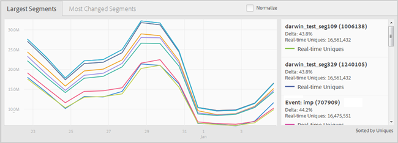

# Painel de relatórios {#reports-dashboard}

Use o Painel para obter informações visualizações sobre a contagem exclusiva de visitantes, divididas por tipos de características e segmentos, por um período de tempo especificado.

<!-- 

c_dashboard.xml

 -->

[!DNL Audience Manager] usa  [!UICONTROL Role Based Access Control] ([!UICONTROL RBAC]) para estender permissões de grupo de usuários ao  [!UICONTROL Dashboard]. Os usuários podem ver apenas informações sobre o painel que possuem permissões para a visualização. [!UICONTROL RBAC] permite controlar quais equipes internas de dados de relatórios são capazes de visualização.

Por exemplo, uma agência que gerencia diferentes contas de anunciantes pode configurar permissões de grupo de usuários para que uma equipe que gerencia a conta do anunciante A não possa ver os dados de relatórios do anunciante B. Este painel pode ser usado para solucionar problemas de delivery de dados.

Por exemplo, se você notar uma queda ou um pico, no total de usuários únicos com o detalhamento do tipo de usuário único (baseado em regras vs. a bordo), você terá um ponto de partida melhor para rastrear um potencial problema de delivery de dados. Se você notar uma queda no total de usuários únicos e em usuários únicos embarcados, poderá acessar o relatório [!UICONTROL On-boarding Status] para ver se houve um problema com um arquivo de entrada.

**Para acessar o Painel:**

1. No menu de navegação superior, clique em **[!UICONTROL Dashboard]**.
2. ** OpcionalSelecione o período desejado na última data do relatórios na lista suspensa (7 Dias, 14 Dias (o padrão), 30 Dias ou 60 Dias).

   Dependendo do período selecionado, a alteração delta nos painéis [!UICONTROL Largest Traits] > [!UICONTROL Most Changed Traits] e [!UICONTROL Largest Segments] > [!UICONTROL Most Changed Segments] exibe a alteração em visitantes únicos na audiência durante o período que termina hoje em vez do período anterior com o mesmo comprimento. Por exemplo, se você selecionar 7 Dias, o delta compara os visitantes únicos nos sete dias anteriores que terminaram hoje com os visitantes únicos nos sete dias anteriores.

   >[!NOTE]
   >
   >Você pode investigar uma alteração delta que parece fora do comum ao executar um relatório [!UICONTROL Trend]. Por exemplo, se você vir uma alteração delta invulgarmente grande durante os últimos sete dias, poderá executar um relatório [!UICONTROL Trend] nos últimos 14 dias (2 x 7) para entender melhor os números.

   Dependendo das permissões do usuário conectado, os seguintes painéis são exibidos:

   * [Parceiros únicos](../reporting/reports-dashboard.md#partner-uniques)
   * [Maiores características/Características mais alteradas](../reporting/reports-dashboard.md#largest-traits)
   * [Principais segmentos/segmentos mais alterados](../reporting/reports-dashboard.md#most-changed-segments)

3. ** OpcionalClique  **[!UICONTROL Normalize]** acima de qualquer gráfico para mostrar todos os dados na mesma escala. Você também pode passar o mouse sobre qualquer ponto de dados para ver mais informações.

## Uniques de Parceiro {#partner-uniques}

Permissão necessária para a Visualização: [!UICONTROL View All Traits].

Esse painel exibe o número de visitantes únicos durante o período especificado. Linhas individuais codificadas por cores representam o número total de visitantes únicos e o número de visitantes únicos capturados usando características algorítmicas, baseadas em regras e integradas.

>[!NOTE]
>
>O número total de visitantes únicos representa visitantes capturados por características baseadas em regras ou a bordo. No entanto, o número total de visitantes únicos não é igual à soma dos visitantes únicos capturados usando as características integradas e baseadas em regras. O mesmo usuário exclusivo pode ser representado em qualquer um desses dois tipos de características.

## Maiores características/Características mais alteradas {#largest-traits}

Permissão necessária para a Visualização: [!UICONTROL View Traits].

Esse painel exibe o número de visitantes únicos capturados por várias características.

Use a lista suspensa **[!UICONTROL Show]** para exibir informações sobre diferentes tipos de características: [!UICONTROL All Traits], [!UICONTROL Algorithmic], [!UICONTROL Onboarded] ou [!UICONTROL Rule-Based].

Esse painel contém as seguintes guias:

<table id="table_DA48BDEB4E0143BEA4EB85AC26FF6AE3"> 
 <thead> 
  <tr> 
   <th colname="col1" class="entry"> Tabulação </th> 
   <th colname="col2" class="entry"> Descrição </th> 
  </tr> 
 </thead>
 <tbody> 
  <tr> 
   <td colname="col1"> 
 Maiores características 
 </td> 
   <td colname="col2"> 
Exibe informações sobre o número de visitantes únicos classificados por número (maior ou menor) e também lista a alteração delta de visitantes únicos durante o período especificado. 
 </td> 
  </tr> 
  <tr> 
   <td colname="col1"> 
 Características mais alteradas 
 </td> 
   <td colname="col2"> 
Exibe informações sobre o número de visitantes únicos classificados pela alteração delta. 
 </td> 
  </tr> 
 </tbody> 
</table>

## Principais segmentos/segmentos mais alterados {#most-changed-segments}

Permissão necessária para a Visualização: [!UICONTROL View Segments].

Esse painel exibe o número de visitantes únicos capturados por vários segmentos em tempo real.

Esse painel contém as seguintes guias:

<table id="table_8E22E0579FA74C5A86CC40B40B2548BE"> 
 <thead> 
  <tr> 
   <th colname="col1" class="entry"> Tabulação </th> 
   <th colname="col2" class="entry"> Descrição </th> 
  </tr> 
 </thead>
 <tbody> 
  <tr> 
   <td colname="col1"> 
 Maiores segmentos 
 </td> 
   <td colname="col2"> 
Exibe informações sobre o número de visitantes únicos e a alteração delta de visitantes únicos durante o período especificado. 
 </td> 
  </tr> 
  <tr> 
   <td colname="col1"> 
 Segmentos mais alterados 
 </td> 
   <td colname="col2"> 
Exibe informações sobre o número de visitantes únicos classificados pela alteração delta. 
 </td> 
  </tr> 
 </tbody> 
</table>

