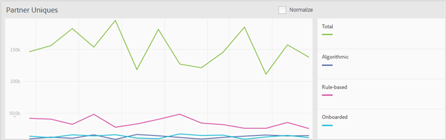

# Painel de relatórios {#reports-dashboard}

Use o Painel para exibir informações sobre suas contagens de visitantes únicos detalhadas por tipos de características e segmentos, por um período de tempo especificado.

<!-- 

c_dashboard.xml

 -->

[!DNL Audience Manager] O usa  [!UICONTROL Role Based Access Control] ([!UICONTROL RBAC]) para estender as permissões do grupo de usuários para o  [!UICONTROL Dashboard]. Os usuários podem ver apenas as informações no painel que têm permissões para exibir. [!UICONTROL RBAC] permite controlar quais dados de relatórios as equipes internas podem visualizar.

Por exemplo, uma agência que gerencia diferentes contas de anunciantes pode configurar permissões de grupo de usuários para que uma equipe que gerencia a conta do anunciante A não possa ver os dados de relatório do anunciante B. Esse painel pode ser usado para solucionar problemas de entrega de dados.

Por exemplo, se você observar um declínio ou um pico no total de usuários únicos com o detalhamento do tipo de usuário único (baseado em regras vs. integrado), você terá um ponto de partida melhor para rastrear um possível problema de entrega de dados. Se você observar uma queda no total de usuários únicos e em usuários únicos integrados, poderá acessar o relatório [!UICONTROL On-boarding Status] para ver se houve um problema com um arquivo de entrada.

**Para acessar o Painel:**

1. No menu de navegação superior, clique em **[!UICONTROL Dashboard]**.
2. ** Opcional: selecione o período de tempo desejado na última data de relatório da lista suspensa (7 Dias, 14 Dias (o padrão), 30 Dias ou 60 Dias).

   Dependendo do período selecionado, a alteração delta nos painéis [!UICONTROL Largest Traits] > [!UICONTROL Most Changed Traits] e [!UICONTROL Largest Segments] > [!UICONTROL Most Changed Segments] exibe a alteração em visitantes únicos no público-alvo durante o período que termina hoje vs. o período anterior com a mesma duração. Por exemplo, se você selecionar 7 dias, o delta compara os visitantes únicos nos sete dias anteriores que terminaram hoje com os visitantes únicos nos sete dias que terminaram há sete dias.

   >[!NOTE]
   >
   >Você pode investigar uma alteração delta que parece fora do comum executando um relatório [!UICONTROL Trend]. Por exemplo, se você observar uma mudança delta invulgarmente grande nos últimos sete dias, poderá executar um relatório [!UICONTROL Trend] nos últimos 14 dias (2 x 7) para entender melhor os números.

   Dependendo das permissões do usuário conectado, os seguintes painéis são exibidos:

   * [Uniques de parceiros](../reporting/reports-dashboard.md#partner-uniques)
   * [As maiores características/características mais alteradas](../reporting/reports-dashboard.md#largest-traits)
   * [Segmentos maiores/Segmentos mais alterados](../reporting/reports-dashboard.md#most-changed-segments)

3. ** OpcionalClique  **[!UICONTROL Normalize]** acima de qualquer gráfico para mostrar todos os dados na mesma escala. Você também pode passar o mouse sobre qualquer ponto de dados para ver mais informações.

## Uniques de Parceiro {#partner-uniques}

Permissão necessária para exibir: [!UICONTROL View All Traits].

Esse painel exibe o número de visitantes únicos durante o período especificado. As linhas individuais codificadas por cores representam o número total de visitantes únicos e o número de visitantes únicos capturados usando características algorítmicas, baseadas em regras e integradas.

>[!NOTE]
>
>O número total de visitantes únicos representa visitantes capturados por meio de características integradas ou com base em regras. No entanto, o número total de visitantes únicos não é igual à soma de visitantes únicos capturados usando as características integradas e com base em regras. O mesmo usuário exclusivo pode ser representado em um desses dois tipos de características.

## As maiores características/características mais alteradas {#largest-traits}

Permissão necessária para exibir: [!UICONTROL View Traits].

Esse painel exibe o número de visitantes únicos capturados por várias características.

Use a lista suspensa **[!UICONTROL Show]** para exibir informações sobre diferentes tipos de características: [!UICONTROL All Traits], [!UICONTROL Algorithmic], [!UICONTROL Onboarded] ou [!UICONTROL Rule-Based].

Esse painel contém as seguintes guias:

<table id="table_DA48BDEB4E0143BEA4EB85AC26FF6AE3"> 
 <thead> 
  <tr> 
   <th colname="col1" class="entry"> Tabulação </th> 
   <th colname="col2" class="entry"> Descrição </th> 
  </tr> 
 </thead>
 <tbody> 
  <tr> 
   <td colname="col1"> 
 As maiores características 
 </td> 
   <td colname="col2"> 
Exibe informações sobre o número de visitantes únicos classificados por número (do mais alto ao mais baixo) e também lista a alteração delta de visitantes únicos durante o período especificado. 
 </td> 
  </tr> 
  <tr> 
   <td colname="col1"> 
 Características mais alteradas 
 </td> 
   <td colname="col2"> 
Exibe informações sobre o número de visitantes únicos classificados pela alteração do delta. 
 </td> 
  </tr> 
 </tbody> 
</table>

## Principais segmentos/Segmentos mais alterados {#most-changed-segments}

Permissão necessária para exibir: [!UICONTROL View Segments].

Esse painel exibe o número de visitantes únicos capturados por vários segmentos em tempo real.

Esse painel contém as seguintes guias:

<table id="table_8E22E0579FA74C5A86CC40B40B2548BE"> 
 <thead> 
  <tr> 
   <th colname="col1" class="entry"> Tabulação </th> 
   <th colname="col2" class="entry"> Descrição </th> 
  </tr> 
 </thead>
 <tbody> 
  <tr> 
   <td colname="col1"> 
 Principais segmentos 
 </td> 
   <td colname="col2"> 
Exibe informações sobre o número de visitantes únicos e a alteração delta de visitantes únicos durante o período especificado. 
 </td> 
  </tr> 
  <tr> 
   <td colname="col1"> 
 Segmentos mais alterados 
 </td> 
   <td colname="col2"> 
Exibe informações sobre o número de visitantes únicos classificados pela alteração do delta. 
 </td> 
  </tr> 
 </tbody> 
</table>
