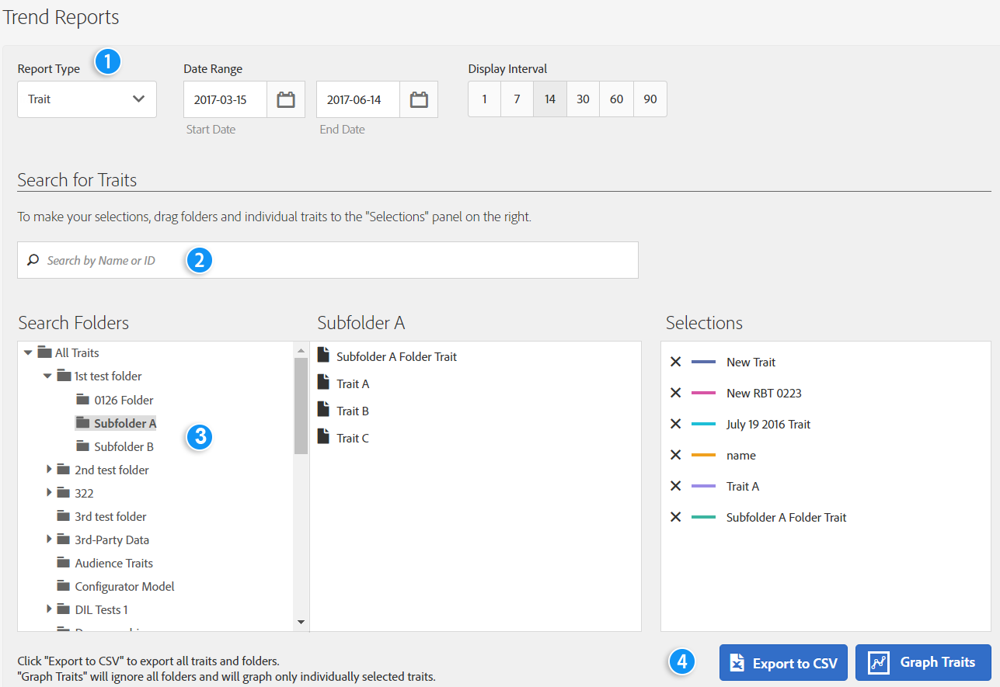

# Relatórios de tendência{#trend-reports}

Um relatório de tendência retorna dados de tendência sobre características e segmentos.

## Visão geral {#trend-report-overview}

<!-- 

c_trend_reports.xml

 -->

[!DNL Audience Manager] usa [!UICONTROL Role Based Access Control] ([!UICONTROL RBAC]) para estender permissões de grupo de usuários aos relatórios [!UICONTROL Trend]. Os usuários podem ver somente essas características e segmentos nos relatórios que têm permissão para visualizar. A funcionalidade [!UICONTROL RBAC] permite controlar quais dados de relatório as equipes internas podem exibir.

Por exemplo, uma agência que gerencia diferentes contas de anunciante pode configurar permissões de grupo de usuários para que uma equipe que gerencia a conta do Anunciante A não possa ver os dados de relatório do Anunciante B.

Execute um relatório [!UICONTROL Trend] quando precisar:

* Analise os dados de tendência por características e segmentos.
* Rastreie tendências em intervalos de 1, 7, 14, 30, 60 e 90 dias.
* Comparar tendências de características e segmentos ao longo do tempo.
* Identifique características e segmentos de desempenho fortes ou ruins.
* Exporte dados (formato .csv) para análise e compartilhamento adicional.

A ilustração a seguir fornece uma visão geral de alto nível dos principais elementos do relatório [!UICONTROL Trend].

1. Configure as seguintes opções:
   **Tipo de relatório:** selecione o tipo de relatório desejado (Característica ou Segmento).
   **Intervalo de datas:** especifique o intervalo de datas do relatório (data inicial e data final).
   **Intervalo de Exibição:** Especifique o intervalo de exibição (intervalos de 1, 7, 14, 30, 60 e 90 dias).
1. Procure uma característica ou segmento por nome ou ID.
1. Na lista de pastas, arraste e solte as características ou os segmentos que deseja relatar no painel [!UICONTROL Selections] no lado direito.
1. Gere o relatório para ser exibido nos dados em formato gráfico ou exporte o relatório para o formato CSV.

## Executar um relatório de tendências {#run-trend-report}

Este procedimento descreve como executar um relatório [!UICONTROL Trend].

<!-- 

t_working_with_trend_reports.xml

 -->

1. No painel **[!UICONTROL Analytics]**, clique em **[!UICONTROL Trend Reports]**.
1. Na lista suspensa **[!UICONTROL Report Type]**, selecione o tipo desejado: **[!UICONTROL Trait]** ou **[!UICONTROL Segment]**.
1. Clique nas caixas de data para exibir um calendário e, em seguida, selecione as datas inicial e final para seu relatório.
1. Especifique o intervalo de exibição: por 1, 7, 14, 30, 60 ou 90 dias.
1. Procure uma característica ou segmento por nome ou ID.
1. Na lista de pastas, arraste e solte as características ou os segmentos que deseja relatar no painel [!UICONTROL Selections] no lado direito.
   * Para obter o melhor desempenho, execute um relatório [!UICONTROL Trend] sobre menos de 20 características ou segmentos de cada vez.
1. Clique em **[!UICONTROL Graph Traits]** ou **[!UICONTROL Graph Segments]**, dependendo do tipo de relatório que você está visualizando (Características ou Segmentos). Essas opções ignoram todas as pastas e gráficos somente características ou segmentos selecionados individualmente.

   Ou

   Clique em **[!UICONTROL Export to CSV]** para exportar os dados de características ou segmentos e todas as pastas no formato CSV para análise e compartilhamento adicional. Isso exporta o [!UICONTROL Unique Trait Realizations], [!UICONTROL Total Trait Realizations] e [!UICONTROL Total Trait Population] para todos os intervalos de dias.

   >[!NOTE]
   >
   >[!UICONTROL Total Trait Realizations] são calculados somente para [!UICONTROL Rule-based Traits].

1. (Opcional) Passe o mouse sobre características ou segmentos individuais para exibir o número de visitas e a data de cada ponto de dados. Você pode clicar nos cabeçalhos de coluna na tabela para classificar os resultados em ordem crescente ou decrescente.

## Resultados do relatório de tendências para características {#trend-report-results-traits}

Os filtros abaixo estão disponíveis quando você executa um [!UICONTROL Trend Report] e seleciona **[!UICONTROL Trait]** como o tipo de relatório.

Ao filtrar os resultados por [!UICONTROL Device ID]:

* [!UICONTROL Unique Trait Realizations] é o número de visitantes de dispositivos anônimos que adicionaram a característica a seus perfis dentro do intervalo de tempo selecionado.
* [!UICONTROL Total Trait Realization] é o número total de realizações de características anônimas no intervalo de tempo selecionado.
* [!UICONTROL Total Trait Population] é o número de visitantes de dispositivos anônimos que possuem essa característica em seus perfis.

Ao filtrar os resultados por [!UICONTROL Cross-Device ID]:

* [!UICONTROL Unique Trait Realizations] é o número de visitantes autenticados que adicionaram a característica ao perfil, dentro do intervalo de tempo selecionado.
* [!UICONTROL Total Trait Realization] é o número total de realizações de características autenticadas dentro do intervalo de tempo selecionado.
* [!UICONTROL Total Trait Population] é o número de visitantes autenticados que possuem esta característica no perfil.

Zeros indicam que [!DNL Audience Manager] não coletou dados para esse dia. Entradas em branco indicam que a característica não existia.

Assista ao vídeo abaixo para obter uma visão detalhada de como as métricas entre dispositivos funcionam.

[Noções básicas sobre métricas entre dispositivos no Audience Manager](https://experienceleague.adobe.com/pt-br/docs/audience-manager-learn/tutorials/build-and-manage-audiences/profile-merge/understanding-cross-device-metrics-in-audience-manager)

## Resultados do relatório de tendências para segmentos {#segment-report-results-traits}

Os filtros abaixo estão disponíveis quando você executa um [!UICONTROL Trend Report] e seleciona **[!UICONTROL Segments]** como o tipo de relatório.

* **[!UICONTROL Real-time Segment Population]**: o número de visitantes qualificados para o segmento dentro do intervalo de tempo selecionado.
* **[!UICONTROL Total Segment Population]**: o número total de visitantes qualificados para o segmento.

